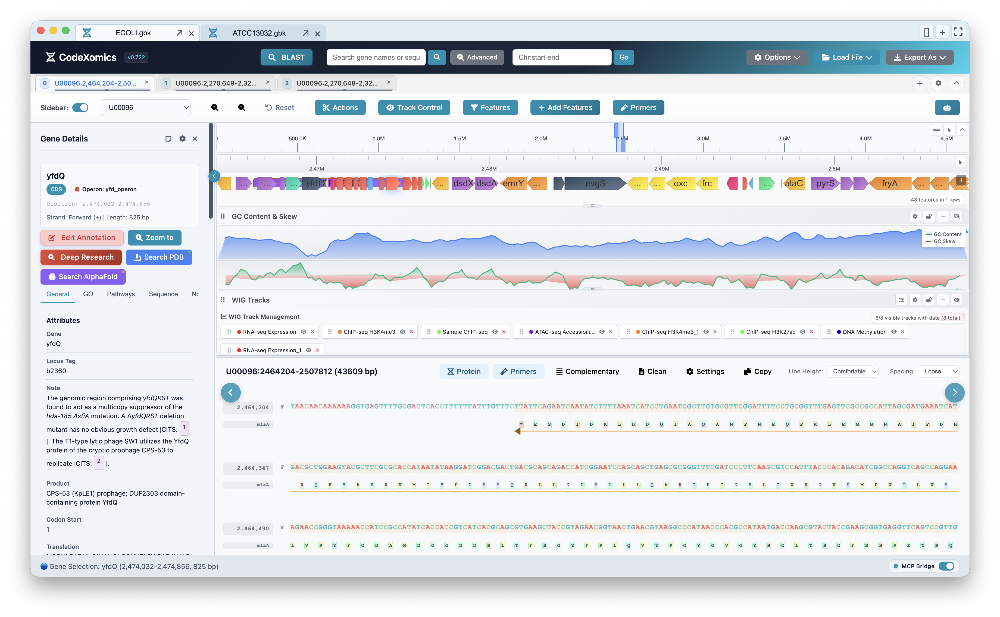
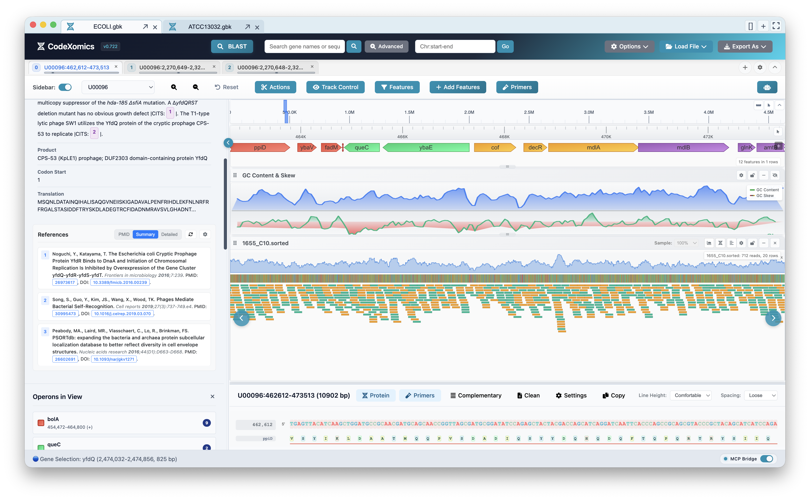
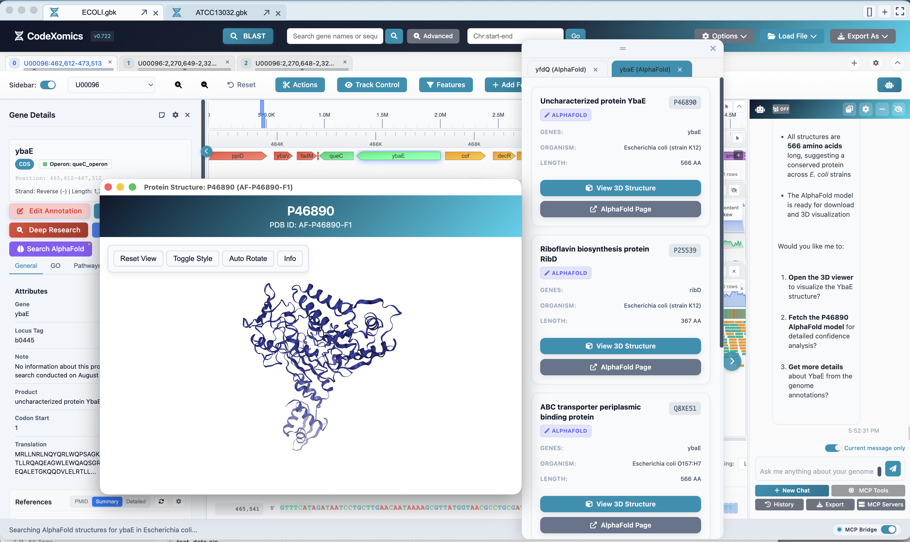
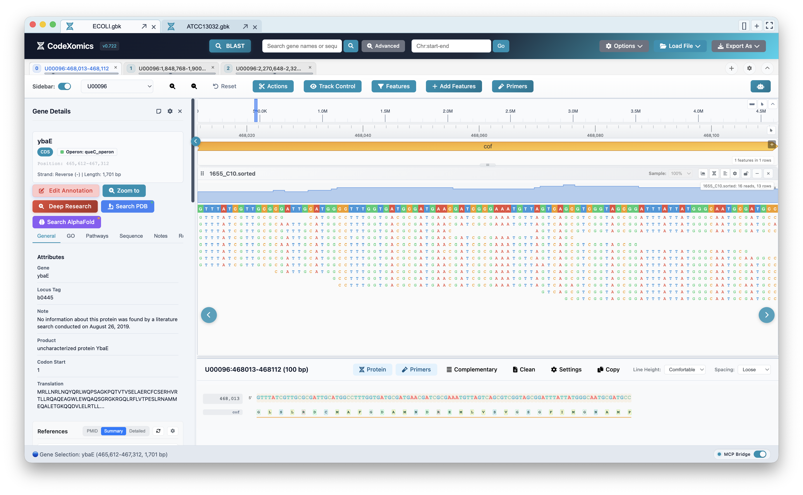
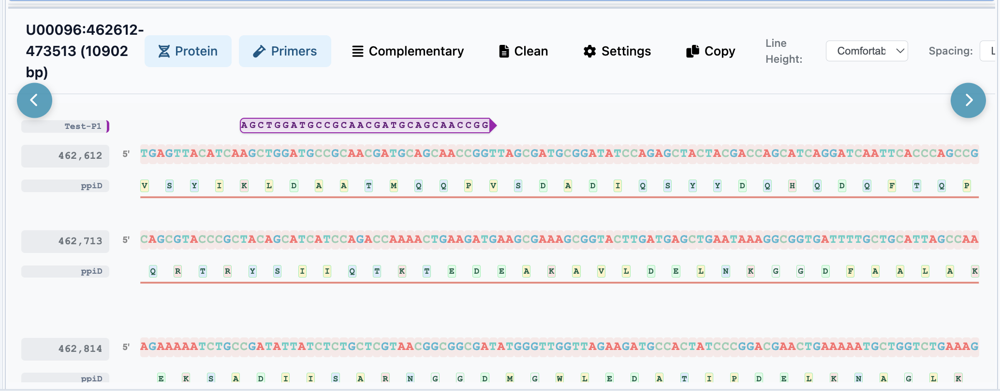

<div align="center">

# CodeXomics

### AI-powered bioinformatics analysis platform

[](https://github.com/Scilence2022/CodeXomics/releases)
[](LICENSE)
[](https://github.com/Scilence2022/CodeXomics/releases)
[](https://www.electronjs.org/)

CodeXomics is a cross-platform Electron desktop application for genome visualization, AI-assisted biological analysis, tool execution, plugin development, and Model Context Protocol (MCP) integration.

Current source release: `0.722.0` (`v0.722` in the application UI). Published installers on GitHub Releases may lag behind the source release.

[Documentation](https://scilence2022.github.io/CodeXomics/) •
[Getting Started](docs/user-guides/GETTING_STARTED.md) •
[Developer Guide](docs/developer-guides/DEVELOPER_GUIDE.md) •
[MCP Server](docs/user-guides/MCP_SERVER_GUIDE.md) •
[Releases](https://github.com/Scilence2022/CodeXomics/releases)

</div>

---

## What CodeXomics Provides

CodeXomics combines a genome browser, a multi-agent AI assistant, a dynamic tool registry, a plugin marketplace, and standalone bioinformatics utilities in one desktop workspace.

Core capabilities:

- Interactive genome visualization for FASTA, GenBank, GFF/GTF, BED, VCF, SAM/BAM, WIG, KGML, and `.prj.GAI` project files.
- AI ChatBox with multi-provider LLM configuration and dynamic tool injection.
- Seven specialized runtime agents: `CoordinatorAgent`, `AnalysisAgent`, `DataAgent`, `NavigationAgent`, `ExternalAgent`, `PluginAgent`, and `DeepResearchAgent`.
- Dynamic YAML tool registry under `tools_registry/` with 185 current tool schemas across 19 active categories.
- 149 mapped built-in ChatBox tools and 95 MCP tools in tools mode.
- MCP server with tools mode and agent mode, HTTP/SSE transport on port `3002`, and WebSocket transport on port `3003`.
- VS Code-inspired plugin and extension architecture with activation events, contribution registry, command registry, marketplace support, and security validation.
- High-performance SVG and Canvas genome rendering for genes, sequences, reads, variants, GC tracks, and custom annotation tracks.
- Local BLAST integration, primer design, protein structure lookup/viewing, pathway tools, benchmark suites, and PubMed/preprint literature lookup.
- Runtime UI style presets backed by vanilla CSS: default, professional, minimal, pastel, elegant, and midnight.

## Screenshots

<div align="center">



_Genome browser: feature track, GC content and skew, multi-track WIG data, gene details sidebar, and the protein/sequence view._



_Base-resolution and coverage read alignment tracks alongside gene references and operons in the side panel._



_AlphaFold structure lookup and interactive 3D protein viewer, driven from the AI ChatBox._



_Base-level sequencing-read pileup over a selected gene._



_Designed primers rendered directly on the sequence view._

</div>

## Install

### Download

Download the latest available build from [GitHub Releases](https://github.com/Scilence2022/CodeXomics/releases).

### Build From Source

Source builds require Node.js 20 or 22 and npm 10 or newer.

```bash
git clone https://github.com/Scilence2022/CodeXomics.git
cd CodeXomics
npm install
npm start
```

Useful run modes:

```bash
npm run dev                       # Electron app with developer tools
npm run mcp-server                # Standalone MCP server, tools mode
npm run mcp-server -- --mode=agent
npm run start-with-mcp            # Electron app + MCP server
npm run marketplace:start         # Plugin marketplace server
npm run start-with-marketplace    # Electron app + marketplace server
npm run start-full                # Electron app + MCP server + marketplace
```

Build commands:

```bash
npm run build
npm run build:mac
npm run build:win
npm run build:linux
npm run build:all
```

## Quick Start

1. Configure an AI provider in `Options -> Configure LLMs`.
2. Load a genome or project through `File -> Load File` or `File -> Open Project`.
3. Add optional annotation, variant, reads, WIG, or operon files.
4. Use the genome browser, side panels, and ChatBox together.
5. Ask the assistant to run concrete analyses, for example:

```text
Find all DNA polymerase genes.
Calculate GC content for the selected region.
Design primers around lacZ.
Search AlphaFold for the selected protein.
Create a local BLAST database from the current genome.
Run the automatic benchmark suite.
```

## MCP Server

Start the server:

```bash
npm run mcp-server
```

Start agent mode:

```bash
npm run mcp-server -- --mode=agent
```

Default endpoints:

- HTTP/SSE: `http://localhost:3002`
- WebSocket: `ws://localhost:3003`

Tools mode exposes the full MCP tool list. Agent mode exposes `codexomics_chat`, `list_genome_windows`, and `switch_active_window`, then routes analysis through the same ChatBox LLM pipeline used inside the app.

Example HTTP/SSE client configuration:

```json
{
  "mcpServers": {
    "CodeXomics": {
      "url": "http://localhost:3002",
      "transportType": "streamable-http"
    }
  }
}
```

## Architecture At A Glance

```text
CodeXomics/
├── src/
│   ├── main.js                    # Electron entry point
│   ├── main/                      # Extracted main-process modules
│   ├── preload.js                 # Context bridge and IPC surface
│   ├── version.js                 # Centralized application version
│   ├── mcp-server.js              # MCP server entry point
│   ├── mcp-tools/                 # MCP tool modules
│   ├── bioinformatics-tools/      # Standalone HTML analysis windows
│   └── renderer/
│       ├── index.html
│       ├── renderer-modular.js
│       ├── css/                   # Vanilla CSS and theme presets
│       └── modules/
│           ├── Agents/            # Multi-agent runtime
│           ├── chat/              # Chat services and constants
│           ├── core/              # Extension host infrastructure
│           ├── security/          # Sanitization and safety services
│           ├── tracks/            # Shared renderer infrastructure
│           └── benchmark-suites/  # AI benchmark suites
├── tools_registry/                # Dynamic YAML tool registry
├── packages/marketplace-server/   # Plugin marketplace server
├── docs/                          # MkDocs / GitHub Pages source
├── test/                          # Vitest unit and integration tests
├── scripts/                       # Build, version, and packaging scripts
├── Agents.md                      # AI coding-agent rules
├── Memory.md                      # Project architecture memory
└── mkdocs.yml                     # GitHub Pages configuration
```

## Tool Registry

The dynamic registry lives at the repository root in `tools_registry/`. Each tool has its own YAML schema with parameters, keywords, usage examples, and relationships. The registry manager retrieves relevant tools per query instead of injecting every capability into every prompt.

Current YAML categories:

| Category            | YAML tools |
| ------------------- | ---------: |
| `navigation`        |         26 |
| `sequence`          |         17 |
| `coordination`      |         15 |
| `external_apis`     |         14 |
| `file_operations`   |         14 |
| `database`          |         13 |
| `plugin_management` |         12 |
| `sequence_editing`  |         11 |
| `annotation`        |         10 |
| `benchmark`         |          8 |
| `data_management`   |          8 |
| `file_loading`      |          7 |
| `primer_design`     |          6 |
| `protein`           |          5 |
| `system`            |          5 |
| `task_management`   |          5 |
| `pathway`           |          2 |
| `utility`           |          2 |

When adding or changing tools, keep the YAML registry, built-in tool map, `ToolNames.js`, `FunctionCallsOrganizer`, MCP tools, and execution policy rules synchronized. The full checklist is in [Agents.md](Agents.md).

## Documentation

GitHub Pages is built from `docs/` using MkDocs Material and configured by [mkdocs.yml](mkdocs.yml). Root-level project context is maintained in:

- [Agents.md](Agents.md) for AI coding-agent operating rules.
- [Memory.md](Memory.md) for architectural context and historical decisions.
- [docs/index.md](docs/index.md) for the public documentation landing page.

Do not edit generated `site/` output directly. Update files under `docs/` and rebuild Pages from source.

Local documentation commands:

```bash
npm run docs:serve      # Preview at http://127.0.0.1:8000
npm run docs:validate   # Check version/docs consistency and build strictly
npm run docs:deploy     # Publish the current docs to gh-pages
```

The public site is deployed from the same `docs/` sources. Release documentation must keep `README.md`, `Agents.md`, `Memory.md`, `CHANGELOG.md`, `docs/`, and `mkdocs.yml` synchronized.

## Development

```bash
npm test                  # Vitest unit and integration suites
npm run lint              # ESLint
npm run version-validate  # Version consistency checks
npm run docs:validate     # Documentation consistency and strict MkDocs build
```

The project uses vanilla JavaScript, vanilla CSS, Electron, Node.js, D3, DOMPurify, NGL, js-yaml, Vitest, and npm workspaces. TypeScript, React, TailwindCSS, Bootstrap, and atomic CSS frameworks are not part of the application stack.

## Contributing

Before making code changes, read:

- [Agents.md](Agents.md) for repository-specific AI assistant rules.
- [Memory.md](Memory.md) for current architecture and project history.
- [Developer Guide](docs/developer-guides/DEVELOPER_GUIDE.md) for setup and extension points.

Use conventional commit messages. For documentation-only changes, prefer `docs(scope): summary`.

## License

CodeXomics is released under the [MIT License](LICENSE).
