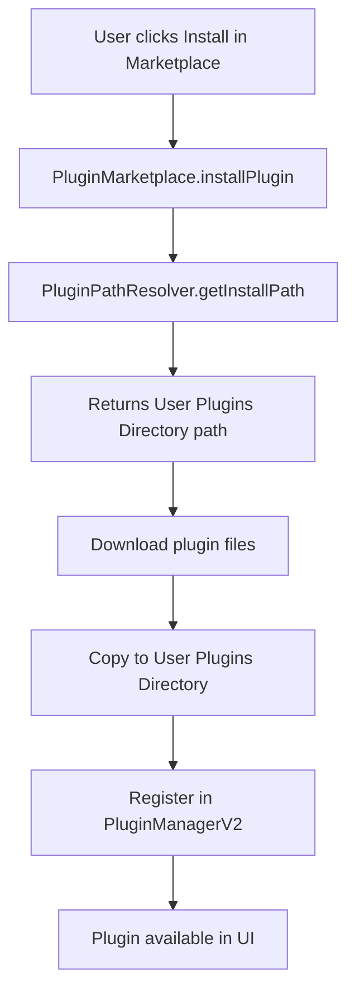

# Plugin Directories UI Improvement

## Overview

This document describes the improvement made to the Plugin Settings interface in the Plugin Management modal, specifically addressing the clarity and accuracy of displaying plugin directory paths.

## Problem Analysis

### Original Design Issues

The Plugin Settings interface had a single "Default Plugin Directory" field that attempted to display both the built-in and user plugin directories in a multi-line text input. This design had several weaknesses:

**Issue 1: Semantic Ambiguity**
The label "Default Plugin Directory" (singular) was misleading because the system actually uses TWO distinct directories with different purposes and permissions.

**Issue 2: Poor Visual Clarity**
Displaying two directories in a single input field with line breaks created confusion:
```
Built-in: src/renderer/modules/Plugins
User: src/renderer/modules/Plugins/UserInstalled
```
This format made it unclear which directory served which purpose.

**Issue 3: Unclear Browse Button**
The "Browse" button was ambiguous - should it browse the built-in directory or the user directory? Since these are managed by `PluginPathResolver`, manual browsing doesn't make sense.

**Issue 4: Architectural Misalignment**
The UI didn't clearly reflect the architectural reality that CodeXomics uses a **dual-directory plugin system**:
- **Built-in Plugins**: Read-only, bundled with application
- **User Plugins**: Writable, installed from marketplace

## Solution Design

### Design Principles

1. **Clarity Over Compactness**: Two separate fields are clearer than one combined field
2. **Semantic Accuracy**: Labels should precisely describe what each directory represents
3. **Read-Only by Design**: Directories are managed by `PluginPathResolver`, not user-configurable
4. **Visual Distinction**: Different styling for read-only vs writable directories

### Implementation Changes

#### UI Structure (index.html)

**Before:**
```html
<div class="form-group">
    <label for="pluginDirectory">Default Plugin Directory:</label>
    <div class="input-group">
        <input type="text" id="pluginDirectory" class="input-full" readonly>
        <button id="browsePluginDir" class="btn btn-secondary">
            <i class="fas fa-folder-open"></i>
            Browse
        </button>
    </div>
</div>
```

**After:**
```html
<p class="help-text" style="margin-bottom: 15px;">
    CodeXomics uses two separate plugin directories:
</p>

<!-- Built-in Plugins Directory -->
<div class="form-group">
    <label for="builtinPluginDirectory">
        <i class="fas fa-box"></i> Built-in Plugins Directory (Read-only):
    </label>
    <input type="text" 
           id="builtinPluginDirectory" 
           class="input-full" 
           readonly 
           style="background-color: #f5f5f5; cursor: not-allowed;"
           title="Built-in plugins bundled with the application">
    <small class="help-text">
        Pre-installed plugins that come with the application
    </small>
</div>

<!-- User Plugins Directory -->
<div class="form-group">
    <label for="userPluginDirectory">
        <i class="fas fa-user"></i> User Plugins Directory (Writable):
    </label>
    <input type="text" 
           id="userPluginDirectory" 
           class="input-full" 
           readonly
           style="background-color: #f0f8ff;"
           title="Plugins installed from the marketplace">
    <small class="help-text">
        Marketplace-installed plugins are stored here
    </small>
</div>
```

**Key Improvements:**

1. **Explanatory Introduction**: Added help text explaining the dual-directory concept
2. **Two Distinct Fields**: Separate inputs for built-in and user directories
3. **Icon Indicators**: Visual icons (box for built-in, user for marketplace)
4. **Permission Labels**: Explicit "(Read-only)" and "(Writable)" in labels
5. **Color Coding**: 
   - Built-in: Gray background (#f5f5f5) with disabled cursor
   - User: Light blue background (#f0f8ff) indicating it's the active install location
6. **Help Text**: Contextual explanation under each field
7. **No Browse Button**: Removed since directories are system-managed

#### JavaScript Logic (PluginManagementUI.js)

**loadPluginSettings() - Before:**
```javascript
const pluginDirectory = document.getElementById('pluginDirectory');
if (pluginDirectory) {
    if (this.pluginManager.pathResolver) {
        const builtinPath = this.pluginManager.pathResolver.getBuiltinPluginsPath();
        const userPath = this.pluginManager.pathResolver.getUserPluginsPath();
        pluginDirectory.value = `Built-in: ${builtinPath}\nUser: ${userPath}`;
        pluginDirectory.title = `Built-in plugins (read-only): ${builtinPath}\nUser plugins (writable): ${userPath}`;
    } else {
        pluginDirectory.value = this.settings.pluginDirectory || 
                              this.configManager?.get('pluginDirectory') || 
                              'src/renderer/modules/Plugins';
    }
}
```

**loadPluginSettings() - After:**
```javascript
const builtinPluginDirectory = document.getElementById('builtinPluginDirectory');
const userPluginDirectory = document.getElementById('userPluginDirectory');

if (this.pluginManager.pathResolver && this.pluginManager.pathResolver._isInitialized) {
    if (builtinPluginDirectory) {
        const builtinPath = this.pluginManager.pathResolver.getBuiltinPluginsPath();
        builtinPluginDirectory.value = builtinPath;
        builtinPluginDirectory.title = `Built-in plugins (read-only): ${builtinPath}`;
    }
    
    if (userPluginDirectory) {
        const userPath = this.pluginManager.pathResolver.getUserPluginsPath();
        userPluginDirectory.value = userPath;
        userPluginDirectory.title = `User-installed plugins (writable): ${userPath}`;
    }
} else {
    // Fallback to legacy behavior if path resolver not available
    const legacyPath = this.settings.pluginDirectory || 
                     this.configManager?.get('pluginDirectory') || 
                     'src/renderer/modules/Plugins';
    
    if (builtinPluginDirectory) {
        builtinPluginDirectory.value = legacyPath;
        builtinPluginDirectory.title = 'Path resolver not initialized';
    }
    
    if (userPluginDirectory) {
        userPluginDirectory.value = legacyPath + '/UserInstalled';
        userPluginDirectory.title = 'Path resolver not initialized';
    }
}
```

**Key Improvements:**

1. **Separate Field Access**: Gets both input elements separately
2. **Initialization Check**: Verifies `PluginPathResolver` is initialized before use
3. **Individual Population**: Sets each field independently with appropriate values
4. **Clear Tooltips**: Descriptive titles for each directory
5. **Graceful Fallback**: Handles case where path resolver isn't ready

**savePluginSettings() - Before:**
```javascript
const pluginDirectory = document.getElementById('pluginDirectory').value;
// ...
this.settings.pluginDirectory = pluginDirectory;
this.configManager.set('pluginDirectory', pluginDirectory);
```

**savePluginSettings() - After:**
```javascript
// Note: Plugin directories are now managed by PluginPathResolver
// They are read-only and don't need to be saved by users

// Only save sandbox and debug settings
this.settings.enablePluginSandbox = enableSandbox;
this.settings.enablePluginDebug = enableDebug;

this.configManager.set('enablePluginSandbox', enableSandbox);
this.configManager.set('enablePluginDebug', enableDebug);
```

**Key Improvements:**

1. **Removed Directory Saving**: Plugin directories no longer saved (managed by system)
2. **Clear Documentation**: Comment explains why directories aren't saved
3. **Simplified Logic**: Only handles user-configurable settings

**Event Handler Cleanup:**
```javascript
// Before
const browsePluginDir = document.getElementById('browsePluginDir');
if (browsePluginDir) {
    browsePluginDir.addEventListener('click', () => {
        this.browsePluginDirectory();
    });
}

// After
// Note: Browse plugin directory button removed
// Plugin directories are now managed automatically by PluginPathResolver
```

**Method Deprecation:**
```javascript
/**
 * Browse plugin directory
 * @deprecated No longer used - plugin directories are managed by PluginPathResolver
 * Kept for potential future use (e.g., quick access to plugin folders)
 */
async browsePluginDirectory() {
    // ... implementation kept but marked deprecated
}
```

## Architectural Alignment

This change better reflects the actual plugin architecture:

### PluginPathResolver Dual-Directory System

```
┌─────────────────────────────────────────────────────┐
│         CodeXomics Plugin Architecture              │
├─────────────────────────────────────────────────────┤
│                                                     │
│  Built-in Plugins Directory (Read-only)            │
│  ├─ Development:  src/renderer/modules/Plugins     │
│  ├─ Production:   Resources/Plugins (ASAR)         │
│  ├─ Purpose:      Pre-installed application plugins│
│  └─ Access:       Read-only, bundled with app      │
│                                                     │
│  User Plugins Directory (Writable)                 │
│  ├─ Development:  src/renderer/modules/Plugins/    │
│  │                UserInstalled                     │
│  ├─ Production:   ~/.genome-browser/plugins        │
│  ├─ Purpose:      Marketplace-installed plugins    │
│  └─ Access:       Read-write, user data directory  │
│                                                     │
└─────────────────────────────────────────────────────┘
```

### Plugin Installation Flow



The updated UI now clearly shows WHERE plugins get installed (User Plugins Directory) vs where built-in plugins reside.

## User Experience Impact

### Visual Comparison

**Before:**
```
┌────────────────────────────────────────┐
│ Default Plugin Directory:              │
│ ┌────────────────────────────────────┐ │
│ │Built-in: src/renderer/...Plugins  │ │
│ │User: src/renderer/...UserInstalled│ │
│ └────────────────────────────────────┘ │
│ [Browse]                               │
└────────────────────────────────────────┘
```
Issues: Confusing multi-line text, unclear which is which

**After:**
```
┌────────────────────────────────────────┐
│ CodeXomics uses two separate plugin   │
│ directories:                           │
│                                        │
│ 📦 Built-in Plugins Directory          │
│    (Read-only):                        │
│ ┌────────────────────────────────────┐ │
│ │src/renderer/modules/Plugins        │ │
│ └────────────────────────────────────┘ │
│ Pre-installed plugins that come with   │
│ the application                        │
│                                        │
│ 👤 User Plugins Directory (Writable):  │
│ ┌────────────────────────────────────┐ │
│ │src/renderer/modules/Plugins/       │ │
│ │UserInstalled                       │ │
│ └────────────────────────────────────┘ │
│ Marketplace-installed plugins are      │
│ stored here                            │
└────────────────────────────────────────┘
```
Benefits: Clear separation, explicit purposes, visual hierarchy

### User Benefits

1. **Clarity**: Users immediately understand there are two directories with different roles
2. **Education**: Help text explains the dual-directory concept
3. **Confidence**: Read-only vs writable labels set correct expectations
4. **Troubleshooting**: Easy to see where installed plugins are stored
5. **No Confusion**: Removed ambiguous Browse button

## Testing Scenarios

### Scenario 1: Normal Operation (PathResolver Initialized)

**Setup:**
- PluginManagerV2 initialized
- PluginPathResolver initialized
- User opens Plugin Settings

**Expected Behavior:**
- Built-in directory shows: `src/renderer/modules/Plugins`
- User directory shows: `src/renderer/modules/Plugins/UserInstalled`
- Both fields are read-only
- Tooltips show full paths
- Help text explains dual-directory system

### Scenario 2: PathResolver Not Initialized (Fallback)

**Setup:**
- PathResolver not ready yet
- User opens Plugin Settings early

**Expected Behavior:**
- Built-in directory shows legacy path
- User directory shows legacy path + '/UserInstalled'
- Tooltips indicate "Path resolver not initialized"
- Fields remain read-only
- No errors thrown

### Scenario 3: Production Environment

**Setup:**
- Application running in packaged ASAR
- User opens Plugin Settings

**Expected Behavior:**
- Built-in directory shows packaged resources path
- User directory shows OS-specific user data path (e.g., `~/.genome-browser/plugins`)
- Paths are correct for the platform (Windows/Mac/Linux)

### Scenario 4: Saving Settings

**Setup:**
- User modifies sandbox/debug checkboxes
- User clicks Save Settings

**Expected Behavior:**
- Plugin directories NOT saved (managed by system)
- Sandbox and debug settings saved correctly
- Success message shown
- Storage info updated

## Backward Compatibility

### Removed Functionality

1. **Browse Button**: No longer present
   - Impact: Users can't manually select plugin directory
   - Justification: Directories are system-managed, manual selection could break plugin system

2. **pluginDirectory Setting**: No longer saved in settings
   - Impact: Old saved `pluginDirectory` values ignored
   - Justification: PluginPathResolver is authoritative source
   - Migration: Automatic - system uses PathResolver instead

### Preserved Functionality

1. **browsePluginDirectory() Method**: Kept but deprecated
   - Status: Marked `@deprecated`, no longer called
   - Reason: May be useful for future "Open in Explorer" feature
   - Impact: None (not exposed in UI)

2. **Legacy Fallback**: Still functional
   - When PathResolver unavailable, falls back to legacy paths
   - Ensures UI doesn't break during initialization

## Performance Impact

**Negligible Performance Change:**
- No network calls
- Simple DOM manipulation
- PathResolver calls are synchronous getters
- Removed one event listener (browse button)

**Estimated Impact:**
- Load time: No change
- Save time: Slightly faster (fewer settings to save)
- Memory: Minimal reduction (one fewer event listener)

## Future Enhancements

### Potential Additions

1. **Quick Access Buttons**: Add buttons to open directories in system file explorer
   ```html
   <button onclick="openInExplorer(builtinPath)">
       <i class="fas fa-external-link-alt"></i> Open
   </button>
   ```

2. **Directory Size Display**: Show disk space used by plugins
   ```
   User Plugins Directory: src/.../UserInstalled (245 MB)
   ```

3. **Plugin Count**: Display number of plugins in each directory
   ```
   Built-in Plugins: 5 plugins
   User Plugins: 12 plugins
   ```

4. **Refresh Button**: Manual refresh of directory paths (useful during dev)

### Not Recommended

1. **Editable Directories**: Should remain read-only to prevent system breakage
2. **Directory Migration**: Too risky, could lose user plugins
3. **Automatic Cleanup**: Could accidentally delete important plugins

## Related Documentation

- [Plugin Path Resolver](../architecture/PLUGIN_PATH_RESOLVER.md)
- [Plugin Demo Path Resolution Fix](./PLUGIN_DEMO_PATH_RESOLUTION_FIX.md)
- [Plugin Installation Guide](../user-guides/PLUGIN_INSTALLATION.md)

## Files Modified

1. **`/src/renderer/index.html`**
   - Replaced single "Default Plugin Directory" field with two separate fields
   - Added help text explaining dual-directory system
   - Removed Browse button
   - Added visual styling and icons

2. **`/src/renderer/modules/PluginManagementUI.js`**
   - Updated `loadPluginSettings()` to populate two separate fields
   - Updated `savePluginSettings()` to skip directory saving
   - Removed Browse button event listener
   - Marked `browsePluginDirectory()` as deprecated

## Conclusion

This improvement transforms the Plugin Directories section from a confusing single-field display into a clear, educational interface that accurately represents CodeXomics' dual-directory plugin architecture. By separating built-in and user directories into distinct, well-labeled fields, users gain a better understanding of where plugins come from and where new installations go. The change aligns the UI with the underlying `PluginPathResolver` system while maintaining backward compatibility through graceful fallbacks.

---

**Version**: 1.0.0  
**Date**: 2025-12-05  
**Issue**: Unclear plugin directory display in Plugin Settings  
**Resolution**: Separated into two distinct, labeled fields with clear purposes  
**Impact**: Improved clarity and user understanding of plugin architecture
