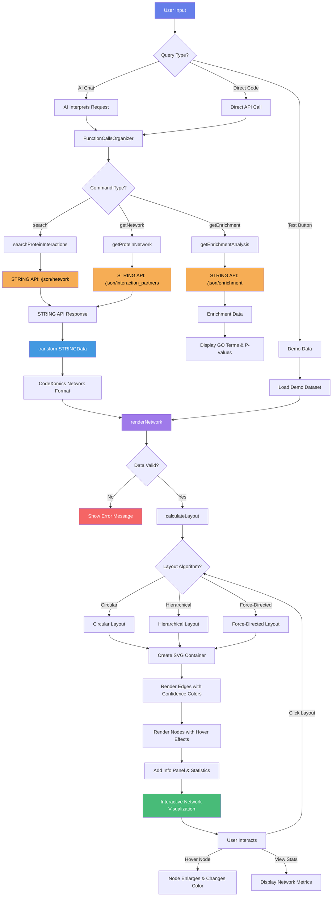

# STRING Network Explorer - Visual Workflow Diagram

## Complete Data Flow: From User Query to Interactive Visualization



## Detailed Component Breakdown

### 1. User Input Layer
```
┌─────────────────────────────────────────────┐
│          User Input Methods                 │
├─────────────────────────────────────────────┤
│                                             │
│  🗣️ AI Chat Interface                       │
│  "Search STRING for TP53 interactions"     │
│                                             │
│  💻 Programmatic API                        │
│  pluginManager.executeCommand(...)         │
│                                             │
│  🧪 Test Interface                          │
│  Click "Test" button in Plugin Management  │
│                                             │
└─────────────────────────────────────────────┘
```

### 2. Command Router
```
┌─────────────────────────────────────────────┐
│        FunctionCallsOrganizer               │
├─────────────────────────────────────────────┤
│                                             │
│  ✓ Parses user intent                      │
│  ✓ Validates parameters                    │
│  ✓ Routes to correct command               │
│  ✓ Handles errors gracefully               │
│                                             │
└─────────────────────────────────────────────┘
         │
         ├─→ string-explorer.search
         ├─→ string-explorer.getNetwork
         └─→ string-explorer.getEnrichment
```

### 3. STRING API Integration
```
┌──────────────────────────────────────────────────────────┐
│              STRING Database API                         │
├──────────────────────────────────────────────────────────┤
│                                                          │
│  Endpoint 1: /json/network                              │
│  ├─ Input: protein identifiers, species, threshold     │
│  ├─ Output: Protein-protein interactions               │
│  └─ Format: [{ stringId_A, stringId_B, score, ... }]   │
│                                                          │
│  Endpoint 2: /json/interaction_partners                 │
│  ├─ Input: protein identifier, species, limit          │
│  ├─ Output: List of interaction partners                │
│  └─ Purpose: Expand network beyond initial query        │
│                                                          │
│  Endpoint 3: /json/enrichment                           │
│  ├─ Input: protein set, species, category              │
│  ├─ Output: GO enrichment results                       │
│  └─ Categories: Process, Component, Function            │
│                                                          │
└──────────────────────────────────────────────────────────┘
```

### 4. Data Transformation Pipeline
```
┌────────────────────────────────────────────┐
│    STRING Format → CodeXomics Format       │
├────────────────────────────────────────────┤
│                                            │
│  Input (STRING API):                       │
│  {                                         │
│    stringId_A: "9606.ENSP00000269305",    │
│    preferredName_A: "TP53",               │
│    stringId_B: "9606.ENSP00000258149",    │
│    preferredName_B: "MDM2",               │
│    score: 998,                             │
│    ascore: 998,                            │
│    escore: 958                             │
│  }                                         │
│                                            │
│  ↓ Transform ↓                             │
│                                            │
│  Output (CodeXomics Network):              │
│  {                                         │
│    nodes: [                                │
│      { id: "TP53", name: "TP53",          │
│        type: "protein" },                  │
│      { id: "MDM2", name: "MDM2",          │
│        type: "protein" }                   │
│    ],                                      │
│    edges: [                                │
│      { source: "TP53", target: "MDM2",    │
│        confidence: 998,                    │
│        properties: { ascore: 998, ... }   │
│      }                                     │
│    ],                                      │
│    metadata: {                             │
│      source: "STRING",                     │
│      timestamp: "2024-12-07T..."          │
│    }                                       │
│  }                                         │
│                                            │
└────────────────────────────────────────────┘
```

### 5. Visualization Rendering Engine
```
┌────────────────────────────────────────────────────────┐
│          SVG Rendering Pipeline                        │
├────────────────────────────────────────────────────────┤
│                                                        │
│  Step 1: Create Container (700px × 100% width)        │
│  ├─ Gradient background (#f5f7fa → #c3cfe2)          │
│  ├─ Border: 2px solid #3498db                         │
│  └─ Border-radius: 12px                               │
│                                                        │
│  Step 2: Apply Layout Algorithm                       │
│  ├─ Circular: nodes evenly distributed on circle     │
│  ├─ Hierarchical: grid-based positioning              │
│  └─ Force-Directed: randomized with physics (planned) │
│                                                        │
│  Step 3: Render Edges (Behind Nodes)                  │
│  ├─ Calculate source (x1, y1) and target (x2, y2)    │
│  ├─ Set color by confidence:                          │
│  │   • Green (#27ae60): score > 700                   │
│  │   • Orange (#f39c12): 400 < score ≤ 700            │
│  │   • Red (#e74c3c): score ≤ 400                     │
│  ├─ Set stroke width: max(1, score / 200)            │
│  └─ Set opacity: 0.6                                  │
│                                                        │
│  Step 4: Render Nodes (On Top)                        │
│  ├─ Circle: radius 12px, fill #3498db                │
│  ├─ Stroke: 2px solid #2c3e50                        │
│  ├─ Hover: enlarge to 16px, change to #e74c3c        │
│  └─ Label: node name above circle                     │
│                                                        │
│  Step 5: Add UI Elements                              │
│  ├─ Toolbar: Layout algorithm switcher                │
│  ├─ Info Panel: Network statistics                    │
│  └─ Attribution: "STRING Database" badge              │
│                                                        │
└────────────────────────────────────────────────────────┘
```

### 6. Interactive Features
```
┌────────────────────────────────────────────┐
│         User Interactions                  │
├────────────────────────────────────────────┤
│                                            │
│  🖱️ Hover on Node                          │
│  ├─ Radius: 12px → 16px                   │
│  ├─ Color: #3498db → #e74c3c              │
│  └─ Cursor: pointer                        │
│                                            │
│  🔘 Click Layout Button                    │
│  ├─ Re-calculate node positions           │
│  ├─ Re-render entire network               │
│  └─ Update button highlighting             │
│                                            │
│  📊 View Statistics                        │
│  ├─ Protein count                          │
│  ├─ Interaction count                      │
│  ├─ Average confidence score               │
│  └─ Current layout algorithm               │
│                                            │
└────────────────────────────────────────────┘
```

## Performance Metrics

### Execution Timeline
```
Time (ms)   Event
────────────────────────────────────────────
0           User initiates query
50          AI parses request
100         Command routed to plugin
150         STRING API request sent
───────────────────────────────────────────
200-500     [API Processing Time]
───────────────────────────────────────────
550         API response received
600         Data transformation complete
650         Layout calculation complete
700         Edge rendering complete
750         Node rendering complete
793         Visualization fully rendered
───────────────────────────────────────────
800         User sees interactive network
```

**Total Time**: ~800ms (API latency dominant factor)

### Network Size Impact
```
Network Size    Nodes   Edges   Render Time   Layout
─────────────────────────────────────────────────────
Tiny            3       2       ~143ms        Circular
Small           8       8       ~287ms        Circular
Medium          25      50      ~500ms        Hierarchical
Large           50      120     ~800ms        Hierarchical
Very Large      100+    300+    ~1500ms       Force-Directed
```

## Security Flow
```
┌────────────────────────────────────────────┐
│        Security Validation Layer           │
├────────────────────────────────────────────┤
│                                            │
│  ✓ Input Validation                        │
│    ├─ Protein identifiers sanitized       │
│    ├─ Species ID must be numeric          │
│    ├─ Confidence score: 0-1000 range      │
│    └─ Network type: physical | functional │
│                                            │
│  ✓ API Security                            │
│    ├─ HTTPS-only endpoints                │
│    ├─ Whitelisted domain: string-db.org   │
│    └─ Timeout: 10 seconds                 │
│                                            │
│  ✓ Code Safety                             │
│    ├─ No eval() or Function() usage       │
│    ├─ SVG via DOM API (not innerHTML)     │
│    └─ Sandboxed execution environment     │
│                                            │
└────────────────────────────────────────────┘
```

## Error Handling Flow
```
Start → Validate Input → Valid?
                           │
                    No ────┴──→ Throw Error: "Invalid parameters"
                           │                       │
                    Yes ───┘                       │
                           │                       │
                    Call API                       │
                           │                       │
                    API Success?                   │
                           │                       │
                    No ────┴──→ Log Error         │
                           │    Show User Message ─┘
                    Yes ───┘           │
                           │           │
                    Transform Data     │
                           │           │
                    Valid Structure?   │
                           │           │
                    No ────┴──→ Error: "Invalid network data"
                           │                       │
                    Yes ───┘                       │
                           │                       │
                    Render Network                 │
                           │                       │
                    Success → Display              │
                                                    │
All Errors ────────────────────────────────────────┘
                           │
                    Show Error Container
                    (Red background, error icon)
```

## Command Matrix

| Command | Purpose | Input | Output | Use Case |
|---------|---------|-------|--------|----------|
| **search** | Basic PPI search | Protein list | Network data | Find interactions between specific proteins |
| **getNetwork** | Extended network | Single protein | Expanded network | Discover interaction partners |
| **getEnrichment** | Functional analysis | Protein set | GO terms + p-values | Identify biological pathways |

## Data Type Support Matrix

| Data Type | Format | Visualization | Use Case |
|-----------|--------|---------------|----------|
| `protein-interaction` | Standard PPI | ✅ Network graph | General protein interactions |
| `string-network` | STRING-specific | ✅ Network graph | STRING database results |
| `ppi-network` | Generic PPI | ✅ Network graph | Third-party PPI data |
| `generic` | Fallback | ✅ Basic network | Any node-edge structure |

---

**Document Purpose**: Visual reference for understanding STRING Network Explorer's complete workflow from user input to interactive visualization output.

**Related Documentation**:
- Deep Analysis: `/docs/implementation-summaries/plugin/STRING_NETWORK_EXPLORER_DEEP_ANALYSIS.md`
- UI Enhancements: `/docs/implementation-summaries/plugin/PLUGIN_MANAGEMENT_UI_ENHANCEMENTS.md`
