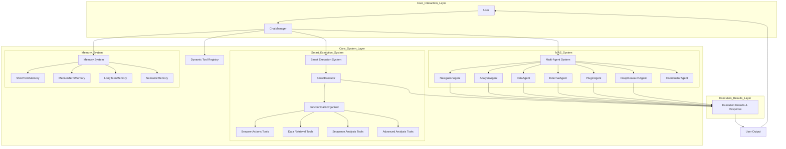

# Agents, Multi-Agent Systems, Dynamic Tool Registration, and Smart Execution System

## Table of Contents

1. [Introduction](#introduction)
2. [System Architecture Overview](#system-architecture-overview)
3. [Multi-Agent System](#multi-agent-system)
   3.1 [Core Components](#core-components)
   3.2 [Agent Types](#agent-types)
   3.3 [Communication Protocols](#communication-protocols)
   3.4 [Resource Management](#resource-management)
4. [Agent Framework](#agent-framework)
   4.1 [AgentBase Class](#agentbase-class)
   4.2 [Specialized Agents](#specialized-agents)
   4.3 [Agent Capabilities](#agent-capabilities)
5. [Memory System](#memory-system)
   5.1 [Multi-Layer Memory Architecture](#multi-layer-memory-architecture)
   5.2 [Memory Management](#memory-management)
   5.3 [Performance Metrics](#performance-metrics)
6. [Dynamic Tool Registration](#dynamic-tool-registration)
   6.1 [Architecture](#architecture)
   6.2 [Tool Definition and Classification](#tool-definition-and-classification)
   6.3 [Tool Selection and Execution](#tool-selection-and-execution)
   6.4 [Integration with ChatBox](#integration-with-chatbox)
7. [Smart Execution System](#smart-execution-system)
   7.1 [SmartExecutor](#smartexecutor)
   7.2 [FunctionCallsOrganizer](#functioncallsorganizer)
   7.3 [Execution Strategies](#execution-strategies)
   7.4 [Performance Optimization](#performance-optimization)
8. [Component Interactions](#component-interactions)
9. [Usage Examples](#usage-examples)
10. [Best Practices](#best-practices)
11. [Conclusion](#conclusion)

## Introduction

This document provides an in-depth technical analysis of the agents, multi-agent systems, dynamic tool registration, and Smart Execution System implemented in the CodeXomics platform. These systems work together to create an intelligent, modular, and efficient architecture for genomic data analysis and visualization.

The implementation follows modern software engineering principles, emphasizing modularity, scalability, and performance optimization. The multi-agent system enables intelligent task distribution, while the dynamic tool registration and Smart Execution System optimize tool selection and execution based on context and priority.

## System Architecture Overview

The system architecture consists of several interconnected components that work together to provide a seamless user experience for genomic analysis. The core components include:

1. **Multi-Agent System**: Coordinates and manages different specialized agents
2. **Agent Framework**: Provides a base class for all agents and defines common interfaces
3. **Memory System**: Implements a multi-layer memory architecture for efficient data storage and retrieval
4. **Dynamic Tool Registration**: Manages and organizes tools for efficient discovery and execution
5. **Smart Execution System**: Optimizes tool execution based on priority, dependencies, and available resources



The system architecture flowchart illustrates the interaction relationships and data flow between components:

- **User Interaction Layer**: Users interact with the system through ChatManager
- **Core System Layer**: Contains four main subsystems
  - **Multi-Agent System (MAS)**: Manages 7 specialized agents
  - **Dynamic Tool Registry**: Handles tool registration and organization
  - **Smart Execution System**: Optimizes tool execution through SmartExecutor and FunctionCallsOrganizer
  - **Memory System**: Implements short-term, medium-term, long-term, and semantic memory
- **Execution Results Layer**: Collects execution results from all components and provides feedback to users


_A comprehensive diagram illustrating the system architecture, component interactions, and data flow processes. Click the SVG file to view it in full resolution._

## Multi-Agent System

The Multi-Agent System (MAS) is the central coordination hub that manages specialized agents, handles communication between them, and optimizes resource allocation. It is implemented in `src/renderer/modules/MultiAgentSystem.js`.

### Core Components

The MAS consists of the following core components:

1. **Agent Registry**: Maintains a registry of all available agents
2. **Communication Protocols**: Defines how agents communicate with each other
3. **Resource Manager**: Allocates and monitors system resources
4. **Task Scheduler**: Prioritizes and schedules tasks for execution

### Agent Types

The system currently implements seven specialized agents:

1. **NavigationAgent**: Handles genome browser navigation and positioning
2. **AnalysisAgent**: Performs sequence and genomic analysis
3. **DataAgent**: Manages data retrieval and storage
4. **ExternalAgent**: Integrates with external APIs and services
5. **PluginAgent**: Handles plugin management and execution
6. **DeepResearchAgent**: Conducts advanced research operations
7. **CoordinatorAgent**: Coordinates activities between other agents

### Communication Protocols

The MAS implements a publish-subscribe communication model where agents can publish events and subscribe to events from other agents. This enables loose coupling and allows agents to operate independently while still coordinating their activities.

```javascript
// Example of communication protocol setup
setupCommunicationProtocols() {
    // Event bus for agent communication
    this.eventBus = new EventEmitter();

    // Register common event handlers
    this.registerCoreEvents();

    // Setup cross-agent communication channels
    this.setupAgentChannels();
}
```

### Resource Management

The MAS includes a resource manager that monitors system resources (CPU, memory) and optimizes allocation based on agent priorities and task requirements. This ensures efficient utilization of system resources and prevents any single agent from monopolizing resources.

## Agent Framework

The Agent Framework provides a common interface and shared functionality for all specialized agents in the system. It is implemented in the `AgentBase` class, which all specialized agents extend.

### AgentBase Class

The `AgentBase` class defines the common interface and functionality that all agents share. Key features include:

1. **Event Handling**: Standardized event registration and handling
2. **State Management**: Common state tracking and management
3. **Resource Tracking**: Monitoring resource usage
4. **Performance Metrics**: Collecting and reporting performance data
5. **Tool Mapping**: Mapping capabilities to specific tools

```javascript
// Example of AgentBase initialization
constructor(agentType, config = {}) {
    this.agentType = agentType;
    this.id = `agent_${agentType}_${Date.now()}`;
    this.config = config;
    this.state = { active: false, busy: false };
    this.capabilities = [];
    this.toolMappings = new Map();
    this.performanceMetrics = {
        tasksCompleted: 0,
        avgExecutionTime: 0,
        errorRate: 0
    };

    // Initialize event system
    this.initializeEvents();
}
```

### Specialized Agents

Each specialized agent extends the `AgentBase` class and implements specific capabilities for its domain. For example, the `NavigationAgent` implements capabilities related to genome browser navigation.

### Agent Capabilities

Agents define their capabilities through a standardized format that includes the capability name, description, priority, and implementation method. This allows for dynamic discovery of agent capabilities and intelligent task routing.

```javascript
// Example capability definition in NavigationAgent
this.capabilities = [
  {
    name: 'navigate_to_position',
    description: 'Navigate to specific genomic position',
    priority: 'high',
    method: 'navigateToPosition',
  },
  {
    name: 'jump_to_gene',
    description: 'Jump to specific gene location',
    priority: 'high',
    method: 'jumpToGene',
  },
  // Additional capabilities...
];
```

## Memory System

The Memory System implements a multi-layer memory architecture that efficiently manages data storage and retrieval for the multi-agent system. It is implemented in `src/renderer/modules/MemorySystem.js`.

### Multi-Layer Memory Architecture

The Memory System consists of four memory layers with different characteristics:

1. **ShortTermMemory**: Fast access, limited capacity, high turnover
2. **MediumTermMemory**: Moderate access speed, medium capacity, longer persistence
3. **LongTermMemory**: Slower access, large capacity, persistent storage
4. **SemanticMemory**: Organized by meaning, optimized for complex queries

### Memory Management

The Memory System includes a `MemoryManager` that coordinates access to the different memory layers and implements caching strategies to optimize performance. It also includes a `MemoryOptimizer` that periodically analyzes memory usage and optimizes the distribution of data across layers.

### Performance Metrics

The Memory System tracks detailed performance metrics to monitor and optimize its operation. These metrics include:

1. **Cache hit rates**: Percentage of memory accesses served from cache
2. **Memory usage**: Distribution of data across memory layers
3. **Retrieval time**: Time taken to retrieve data from each memory layer
4. **Optimization impact**: Performance improvements from memory optimization

## Dynamic Tool Registration

The Dynamic Tool Registration system transforms the platform from a monolithic architecture into a modular, intelligent, and scalable system for tool management. It is implemented as part of the tools_registry module.

### Architecture

The Dynamic Tool Registration system consists of the following core components:

1. **ToolsRegistryManager**: Loads and manages the tool registry
2. **SystemIntegration**: Integrates the dynamic tool system with existing components
3. **ToolsIntegrator**: Integrates multiple tool modules into a unified interface
4. **Tool Definition Files**: YAML files that describe tool functionality and requirements

### Tool Definition and Classification

Tools are defined in YAML files organized by category. The system uses a hierarchical classification structure with 11 functional categories:

1. **Navigation**: Genome browser navigation and state management
2. **Sequence**: DNA/RNA sequence analysis and manipulation
3. **Protein**: Protein structure analysis and visualization
4. **Database**: Biological database integration
5. **AI Analysis**: AI-powered analysis tools
6. **Data Management**: Data annotation and export
7. **Pathway**: Metabolic pathway visualization
8. **Sequence Editing**: Sequence manipulation and editing
9. **Plugin Management**: Plugin system management
10. **Coordination**: Multi-agent coordination
11. **External APIs**: External API integration

### Tool Selection and Execution

The system uses intelligent tool selection based on user intent and context. It analyzes user queries to determine the most relevant tools and generates optimized system prompts that include only the necessary tools.

### Integration with ChatBox

The Dynamic Tool Registration system is integrated with the ChatBox through the `ChatManager` class. This integration replaces the monolithic system prompt approach with a dynamic, context-aware tool selection system.

```javascript
// Example of ChatManager integration with dynamic tools
async initializeDynamicTools() {
    try {
        // Load SystemIntegration module
        const { SystemIntegration } = await import('./tools_registry/system_integration.js');
        this.dynamicTools = new SystemIntegration(this);
        await this.dynamicTools.initialize();
    } catch (error) {
        console.error('Failed to initialize dynamic tools:', error);
        this.dynamicToolsEnabled = false;
    }
}
```

## Smart Execution System

The Smart Execution System optimizes the execution of function calls based on their priority, dependencies, and available resources. It is implemented in `src/renderer/modules/SmartExecutor.js`.

### SmartExecutor

The `SmartExecutor` class is the core of the Smart Execution System. It coordinates the execution of function calls, manages execution state, and collects performance metrics.

```javascript
// Example of SmartExecutor initialization
constructor(chatManager) {
    this.chatManager = chatManager;
    this.app = chatManager.app;
    this.organizer = new FunctionCallsOrganizer(chatManager);

    // Execution state tracking
    this.isExecuting = false;
    this.currentExecution = null;
    this.executionQueue = [];

    // Performance monitoring
    this.executionMetrics = {
        totalExecutions: 0,
        averageTime: 0,
        successRate: 0,
        categoryPerformance: new Map()
    };
}
```

### FunctionCallsOrganizer

The `FunctionCallsOrganizer` class categorizes functions based on their functionality and priority, and develops optimized execution strategies.

### Execution Strategies

The Smart Execution System implements different execution strategies based on function categories and priorities:

1. **Parallel Execution**: For independent functions that can be executed concurrently
2. **Sequential Execution**: For functions with dependencies or state requirements
3. **Priority-Based Execution**: Functions are grouped by priority and executed in order of importance

```javascript
// Example of executeWithStrategy method
async executeWithStrategy(toolRequests, strategy) {
    const results = [];
    const executionPlan = strategy.executionPlan;

    for (const phase of executionPlan) {
        console.log(`🚀 Executing ${phase.phase} (Priority: ${phase.priority})`);

        // Get tools for current phase
        const phaseTools = this.getPhaseTools(toolRequests, phase.tools);

        if (phaseTools.length === 0) continue;

        let phaseResults;

        if (phase.parallelizable && phaseTools.length > 1) {
            // Parallel execution
            phaseResults = await this.executeParallel(phaseTools);
        } else {
            // Sequential execution
            phaseResults = await this.executeSequential(phaseTools);
        }

        results.push(...phaseResults);
    }

    return results;
}
```

### Performance Optimization

The Smart Execution System continuously monitors and optimizes performance based on collected metrics. It uses this data to generate optimization suggestions and improve future execution strategies.

## Component Interactions

The various components of the system interact in a coordinated manner to provide a seamless experience. The typical flow of interactions is:

1. User query is processed by the ChatManager
2. Dynamic Tool Registration system selects relevant tools based on user intent
3. SmartExecutor determines the optimal execution strategy
4. Multi-Agent System routes tasks to appropriate specialized agents
5. Agents utilize the Memory System for data storage and retrieval
6. Execution results are collected, processed, and returned to the user

## Usage Examples

### Example 1: Using the Multi-Agent System

```javascript
// Initialize the multi-agent system
const multiAgentSystem = new MultiAgentSystem(chatManager);
await multiAgentSystem.initialize();

// Execute a task using the appropriate agent
const result = await multiAgentSystem.executeTool('navigate_to_position', {
  chromosome: 'chr1',
  position: 1000000,
});
```

### Example 2: Using the Smart Execution System

```javascript
// Initialize the SmartExecutor
const smartExecutor = new SmartExecutor(chatManager);

// Execute multiple tools with optimization
const results = await smartExecutor.smartExecute('Analyze this gene and show its sequence', [
  { tool_name: 'find_gene_by_name', parameters: { gene: 'BRCA1' } },
  { tool_name: 'get_sequence', parameters: {} },
  { tool_name: 'calculate_gc_content', parameters: {} },
]);
```

### Example 3: Registering a New Tool

```yaml
# tools_registry/sequence/my_new_tool.yaml
tool_name: my_new_tool
category: sequence
description: Perform a specific sequence analysis
type: function
parameters:
  - name: sequence
    type: string
    description: The DNA sequence to analyze
    required: true
  - name: parameter1
    type: string
    description: Additional parameter
    required: false
```

## Best Practices

1. **Agent Development**
   - Follow the AgentBase interface when creating new specialized agents
   - Clearly define capabilities with appropriate priorities
   - Implement proper error handling and resource management

2. **Tool Implementation**
   - Organize tools in appropriate categories
   - Use YAML files for tool definitions
   - Implement proper parameter validation
   - Include comprehensive documentation

3. **Performance Optimization**
   - Use the SmartExecutor for multi-tool execution
   - Consider parallel execution for independent operations
   - Monitor memory usage for efficient data storage
   - Use caching strategically to improve performance

4. **System Integration**
   - Use the dynamic tool registration instead of hardcoding tools
   - Follow the publish-subscribe pattern for agent communication
   - Implement proper event handling and error propagation

## Conclusion

The agents, multi-agent systems, dynamic tool registration, and Smart Execution System implemented in the CodeXomics platform represent a significant advancement in genomic analysis tools. These systems work together to create an intelligent, modular, and efficient architecture that can scale to thousands of tools while maintaining high performance.

The implementation follows modern software engineering principles and best practices, emphasizing modularity, scalability, and performance optimization. By replacing monolithic approaches with dynamic, intelligent systems, the platform is well-positioned to support the evolving needs of genomic research and analysis.

The future enhancements planned for these systems, including machine learning-powered tool recommendation, A/B testing, and analytics dashboards, will further improve the platform's capabilities and user experience.
