# Actions System Visual Diagrams

**Visual reference for understanding the Actions System architecture and workflows**

---

## System Architecture

### Component Overview

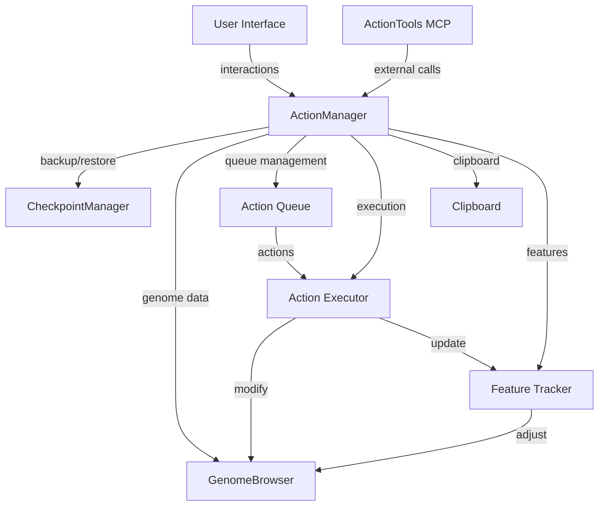

### Data Flow

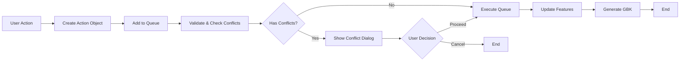

---

## Action Lifecycle

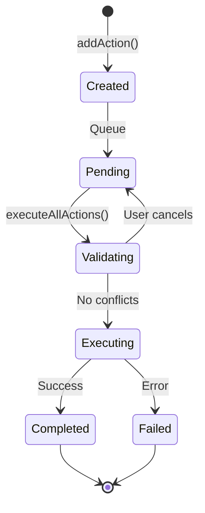

---

## Execution Workflow

### Standard Execution

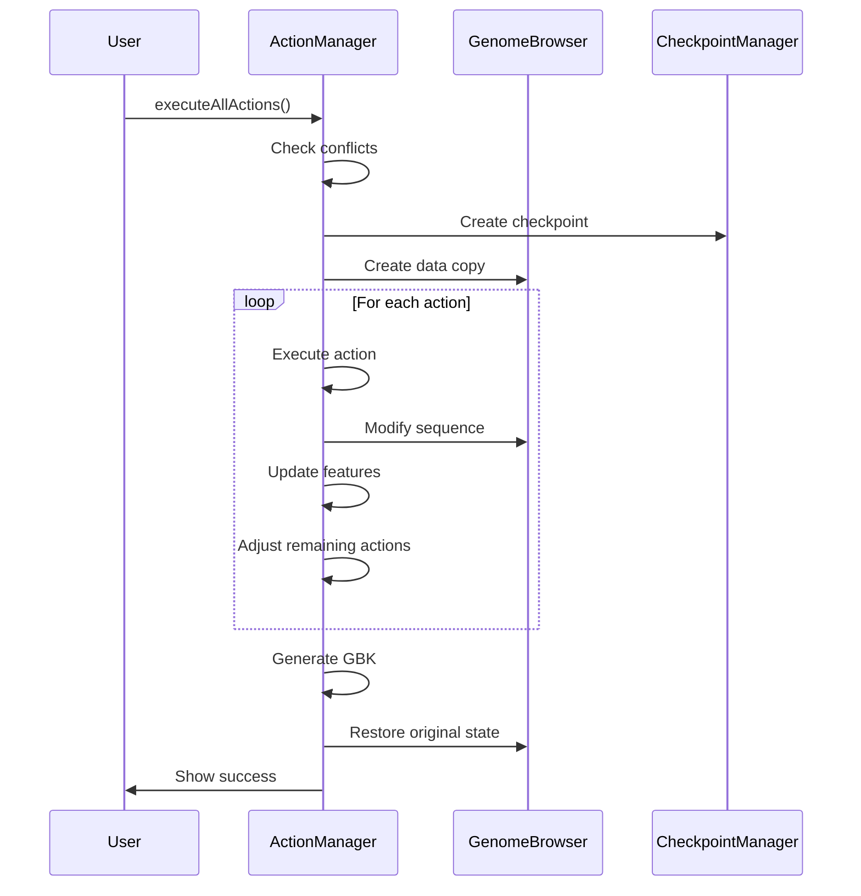

### Execution with Conflicts

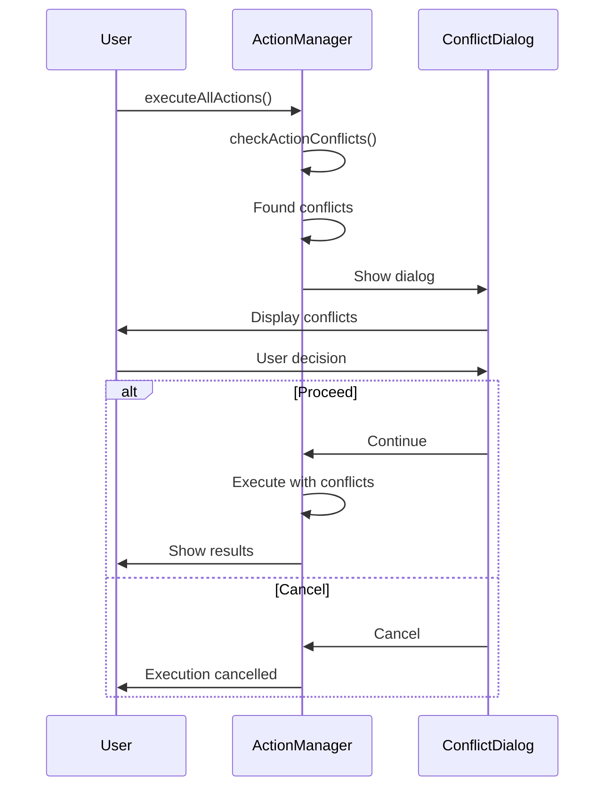

---

## Clipboard Operations

### Copy Operation

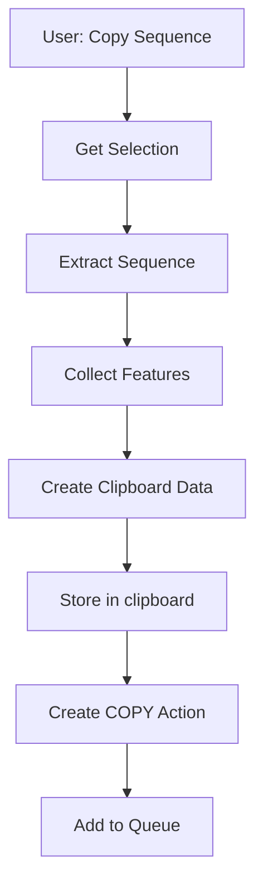

### Paste Operation

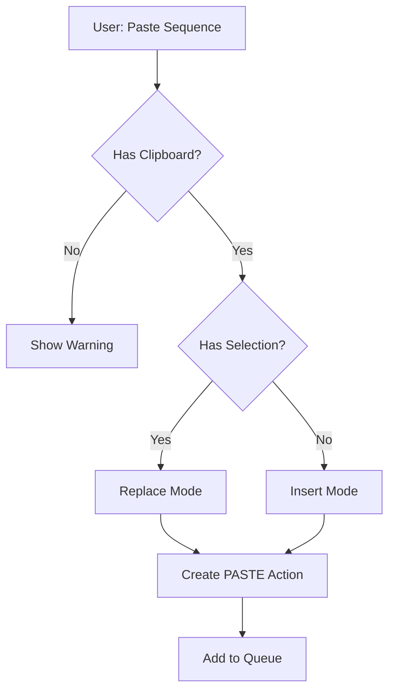

---

## Feature Adjustment Process

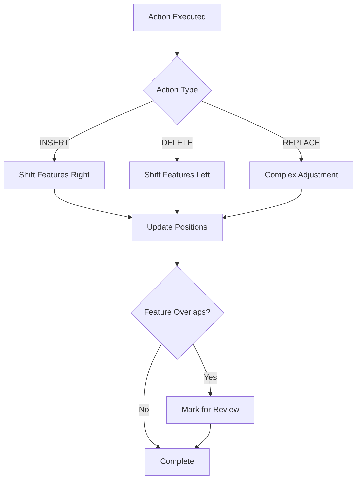

---

## Conflict Detection

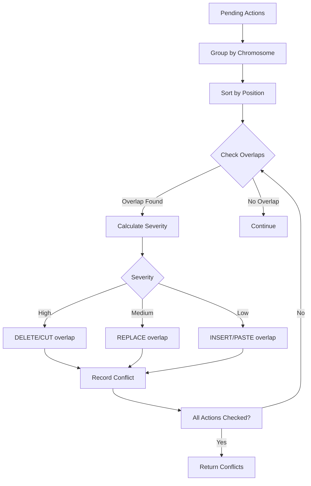

---

## State Management

### Current State (Legacy)

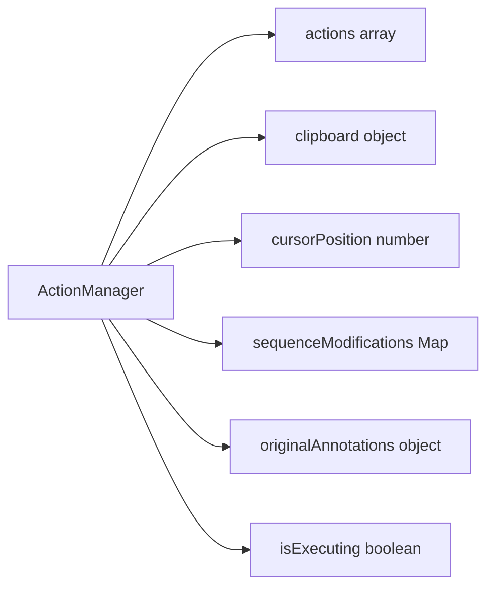

### Proposed State (Modern)

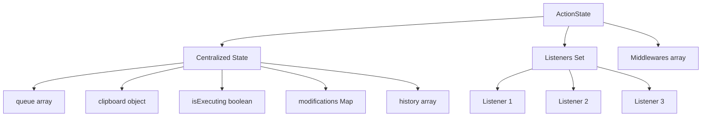

---

## MCP Integration

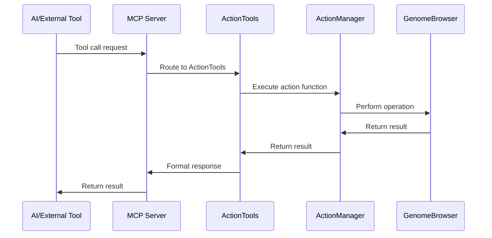

---

## Performance Optimization

### Current Architecture (Deep Copy)

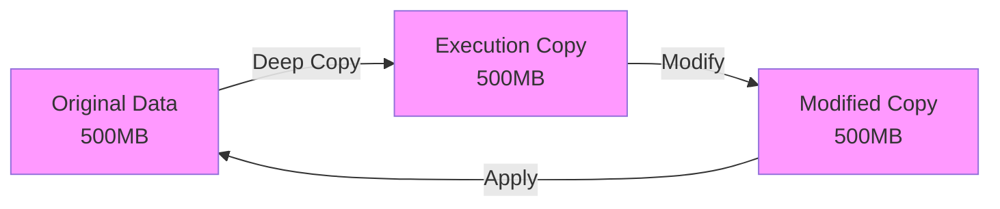

**Memory Usage**: 1.5GB (3x genome size)  
**Time**: 5-60 seconds

### Proposed Architecture (Copy-on-Write)

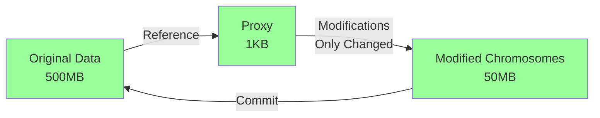

**Memory Usage**: 600MB (1.2x genome size)  
**Time**: 0.5-6 seconds

---

## Error Handling Flow

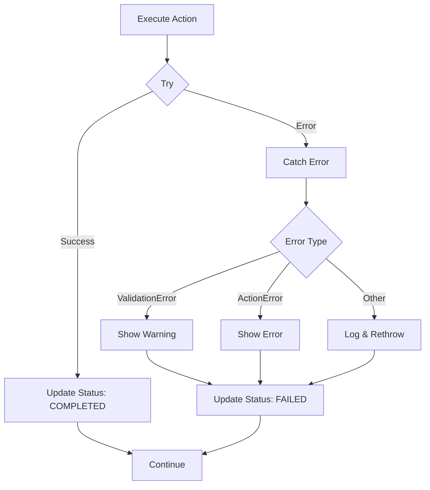

---

## Module Organization (Proposed)

```mermaid
graph TB
    AM[ActionManager]
    
    AM --> C[Core]
    AM --> O[Operations]
    AM --> F[Features]
    AM --> E[Export]
    AM --> U[UI]
    AM --> UT[Utils]
    
    C --> C1[ActionQueue]
    C --> C2[ActionExecutor]
    C --> C3[ActionValidator]
    C --> C4[ActionState]
    
    O --> O1[BaseOperation]
    O --> O2[CopyOperation]
    O --> O3[PasteOperation]
    O --> O4[DeleteOperation]
    O --> O5[InsertOperation]
    O --> O6[ReplaceOperation]
    
    F --> F1[FeatureAdjuster]
    F --> F2[FeatureTracker]
    F --> F3[FeatureValidator]
    
    E --> E1[GenbankExporter]
    E --> E2[ExportFormatter]
    
    U --> U1[ActionListUI]
    U --> U2[ActionModals]
    U --> U3[ConflictDialog]
    
    UT --> UT1[SequenceUtils]
    UT --> UT2[PositionUtils]
    UT --> UT3[ValidationUtils]
```

---

## Testing Strategy

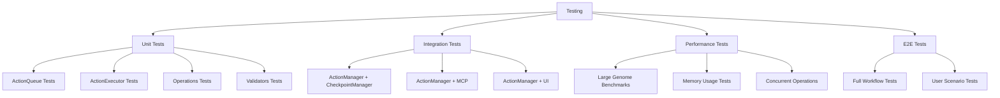

---

## Migration Strategy

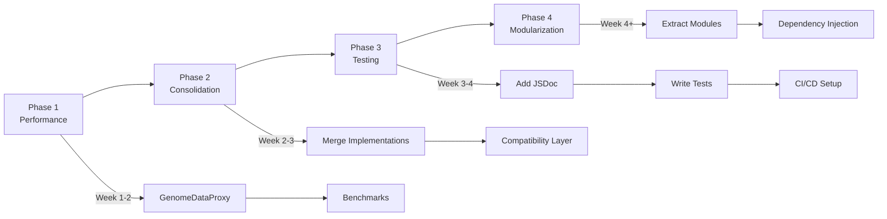

---

## Command Pattern Architecture (Modern)

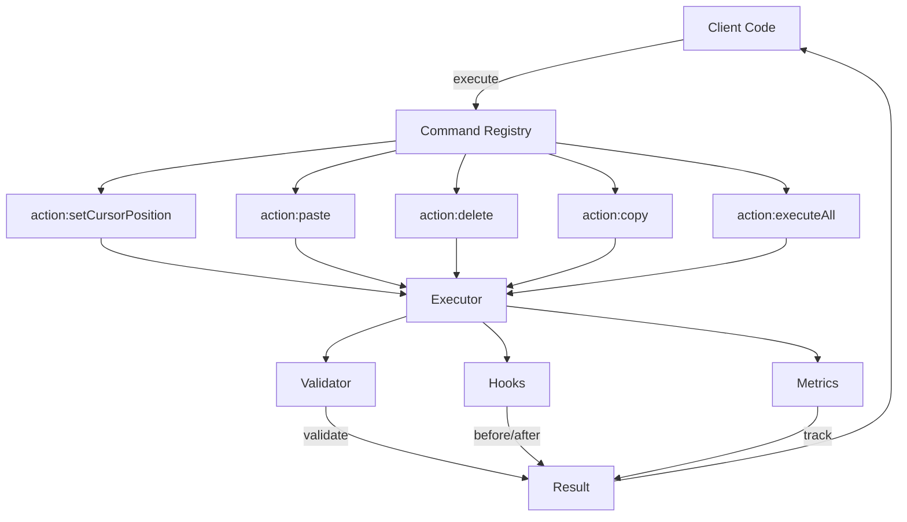

---

## Decision Tree: Which Implementation?

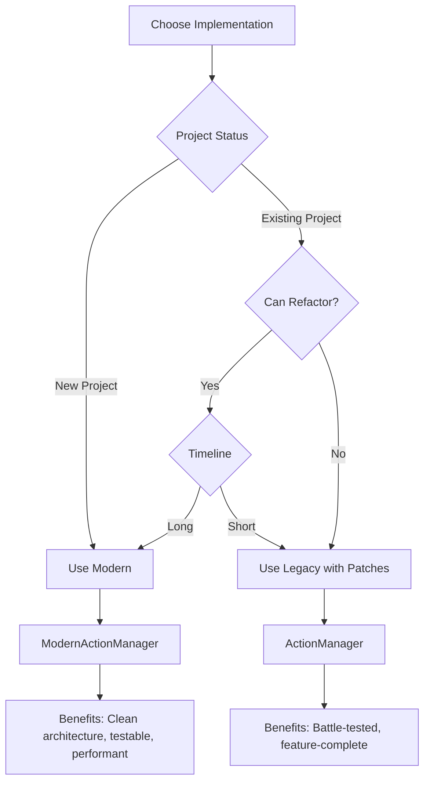

---

## Data Models

### Action Object

```mermaid
classDiagram
    class Action {
        +int id
        +string type
        +string target
        +string details
        +ActionMetadata metadata
        +string status
        +Date timestamp
        +number estimatedTime
        +object result
        +string error
        +Date executionStart
        +Date executionEnd
        +number actualTime
    }
    
    class ActionMetadata {
        +string chromosome
        +number start
        +number end
        +string strand
        +ClipboardData clipboardData
        +string selectionSource
    }
    
    Action --> ActionMetadata
```

### Clipboard Data

```mermaid
classDiagram
    class ClipboardData {
        +string type
        +string sequence
        +string source
        +Date timestamp
        +SelectionInfo sourceInfo
        +ComprehensiveData comprehensiveData
    }
    
    class ComprehensiveData {
        +RegionInfo region
        +Feature[] features
        +Variant[] variants
        +Read[] reads
        +Metadata metadata
    }
    
    ClipboardData --> ComprehensiveData
```

---

## Performance Comparison

### Memory Usage

```mermaid
graph LR
    subgraph Current
        A[Original<br/>500MB] --- B[Copy<br/>500MB] --- C[Modified<br/>500MB]
    end
    
    subgraph Optimized
        D[Original<br/>500MB] --- E[Proxy<br/>1KB] --- F[Changes<br/>50MB]
    end
    
    Current -.->|1500MB total| X[High Memory]
    Optimized -.->|600MB total| Y[Low Memory]
    
    style X fill:#f99
    style Y fill:#9f9
```

### Execution Time

```mermaid
xychart-beta
    title "Execution Time by Genome Size"
    x-axis [1MB, 10MB, 50MB, 100MB]
    y-axis "Time (seconds)" 0 --> 120
    line [0.5, 5, 30, 60]
    line [0.05, 0.5, 3, 6]
```

- Line 1: Current (red)
- Line 2: Optimized (green)

---

## Summary

These diagrams illustrate:

1. **System Architecture**: Component relationships and data flow
2. **Execution Workflow**: Step-by-step process with error handling
3. **Feature Management**: How genomic features are tracked and adjusted
4. **Performance**: Current bottlenecks and proposed optimizations
5. **Migration Path**: Phased approach to improvements
6. **Testing Strategy**: Comprehensive coverage plan

**Usage**: Refer to these diagrams when:
- Understanding system architecture
- Planning modifications
- Debugging issues
- Onboarding new developers
- Presenting to stakeholders

---

**Last Updated**: 2025-11-03  
**Maintained By**: GenomeAIStudio Team
