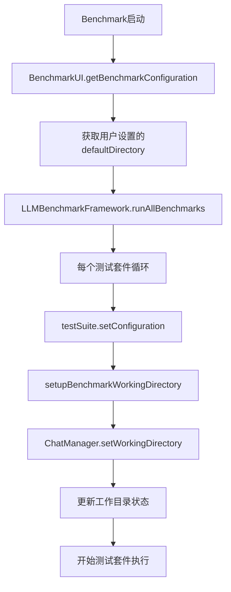

# Benchmark 自动测试文件名指定 & 工作目录深度集成

## 🎯 解决的核心问题

### 问题1: 导出测试用户交互弹窗
**现象**: 自动测试中导出指令没有指定文件名，导致系统弹出文件选择对话框，需要用户手动交互，破坏了自动化测试流程。

**解决方案**: 为所有导出测试指令添加具体的文件路径，确保无用户交互需求。

### 问题2: Benchmark工作目录自动设置  
**现象**: Benchmark开始时，ChatBox的工作目录不会自动设置为Benchmark界面Settings中指定的目录，导致文件操作使用错误的目录位置。

**解决方案**: 在LLMBenchmarkFramework中实现自动工作目录设置机制，确保每个测试套件开始前都正确设置ChatBox工作目录。

## 🔧 技术实现详解

### 1. 自动测试文件名指定修改

#### 修改前 (有用户交互问题)
```javascript
{
    instruction: 'Export sequences in FASTA format.',
    expectedResult: {
        tool_name: 'export_fasta_sequence',
        parameters: {
            format: 'fasta',
            includeDescription: true
            // ❌ 缺少 filePath，会弹出用户文件选择对话框
        }
    }
}
```

#### 修改后 (完全自动化)
```javascript
{
    instruction: `Export sequences in FASTA format to file: ${this.buildFilePath('exported_sequences.fasta')}`,
    expectedResult: {
        tool_name: 'export_fasta_sequence',
        parameters: {
            format: 'fasta',
            includeDescription: true,
            filePath: this.buildFilePath('exported_sequences.fasta') // ✅ 明确指定文件路径
        }
    }
}
```

#### 全部导出测试更新
已更新的导出测试包括：
- `export_auto_01`: FASTA序列导出 → `exported_sequences.fasta`
- `export_auto_02`: GenBank格式导出 → `exported_data.gbk`  
- `export_auto_03`: GFF3注释导出 → `exported_annotations.gff3`
- `export_auto_04`: BED格式导出 → `exported_features.bed`
- `export_auto_05`: CDS FASTA导出 → `exported_cds.fasta`
- `export_auto_06`: 蛋白质FASTA导出 → `exported_proteins.fasta`
- `export_auto_07`: 当前视图FASTA导出 → `exported_region.fasta`

### 2. Benchmark工作目录自动设置

#### 架构设计


#### 关键实现组件

##### 1. BenchmarkUI配置增强
```javascript
getBenchmarkConfiguration() {
    const config = {
        // ... 其他配置
        defaultDirectory: this.getDefaultDirectory(), // CRITICAL: 包含默认目录
        // ... 其他配置
    };
    
    console.log('🔧 [BenchmarkUI] Generated benchmark configuration:', {
        defaultDirectory: config.defaultDirectory,
        // ... 其他信息
    });
    
    return config;
}
```

##### 2. LLMBenchmarkFramework工作目录设置
```javascript
// 在每个测试套件开始前调用
await this.setupBenchmarkWorkingDirectory(
    options.defaultDirectory || '/Users/song/Documents/Genome-AI-Studio-Projects/test_data/'
);
```

##### 3. setupBenchmarkWorkingDirectory方法
```javascript
async setupBenchmarkWorkingDirectory(directoryPath) {
    try {
        // 路径标准化
        const path = require('path');
        const normalizedPath = path.resolve(directoryPath);
        
        // 调用ChatManager的setWorkingDirectory
        const result = await this.chatManager.setWorkingDirectory({
            directory_path: normalizedPath,
            validate_permissions: true,
            create_if_missing: false // Benchmark模式不创建目录
        });
        
        if (result && result.success) {
            // 显示成功信息给用户
            this.chatManager.addThinkingMessage(
                `📁 **Benchmark Environment Setup**<br>` +
                `• Working Directory: \`${result.current_directory}\`<br>` +
                `• Status: ✅ Successfully configured<br>` +
                `• All file operations will use this directory as base path<br><br>`
            );
        }
    } catch (error) {
        // 错误处理但不中断测试
        console.warn('⚠️ [LLMBenchmarkFramework] Continuing benchmark despite working directory setup failure');
    }
}
```

## 🚀 执行流程

### Benchmark启动时的完整流程

1. **用户配置阶段**
   - 用户在Benchmark界面Settings中设置默认目录
   - 配置保存到localStorage和configManager

2. **Benchmark初始化阶段**  
   - `BenchmarkUI.getBenchmarkConfiguration()` 获取所有配置
   - 包括用户设置的`defaultDirectory`

3. **Framework执行阶段**
   - `LLMBenchmarkFramework.runAllBenchmarks(options)` 接收配置
   - 对每个测试套件：
     a. 调用 `testSuite.setConfiguration(options)` 传递目录配置
     b. 调用 `setupBenchmarkWorkingDirectory()` 设置ChatBox工作目录
     c. 开始执行测试套件

4. **ChatBox工作目录同步**
   - ChatManager收到setWorkingDirectory调用
   - 验证目录权限和存在性
   - 更新`this.currentWorkingDirectory`和`process.cwd()`
   - 持久化到配置文件

5. **文件操作测试执行**
   - 所有文件加载/导出操作使用正确的工作目录
   - 导出测试使用明确指定的文件路径，无用户交互需求

## 📊 关键收益

### 1. 完全自动化的测试流程
- ✅ **消除用户交互**: 导出测试不再弹出文件选择对话框
- ✅ **工作目录同步**: Benchmark和ChatBox使用相同的工作目录
- ✅ **文件路径一致性**: 所有文件操作使用统一的基准目录

### 2. 更精确的测试评估
- ✅ **参数验证增强**: 导出测试现在验证filePath参数
- ✅ **目录管理测试**: 包含工作目录设置的系统测试
- ✅ **状态持久化**: 工作目录设置在session间保持

### 3. 用户体验提升
- ✅ **可视化反馈**: 工作目录设置过程在thinking message中显示
- ✅ **错误处理**: 目录设置失败时给出清晰的错误信息和建议
- ✅ **配置持久化**: 用户设置的目录在应用重启后保持

### 4. 开发体验改善
- ✅ **调试信息**: 详细的控制台日志记录目录设置过程
- ✅ **错误恢复**: 目录设置失败不会中断整个测试流程
- ✅ **配置验证**: getBenchmarkConfiguration输出详细的配置信息

## 🔍 技术细节

### 路径处理
```javascript
// 确保路径绝对化和标准化
const path = require('path');
const normalizedPath = path.resolve(directoryPath);
```

### 文件路径构建
```javascript
buildFilePath(filename) {
    const defaultDir = this.getDefaultDirectory();
    const normalizedDir = defaultDir.endsWith('/') ? defaultDir : defaultDir + '/';
    return normalizedDir + filename;
}
```

### 错误处理策略
- **非阻塞错误**: 工作目录设置失败不中断测试执行
- **用户反馈**: 错误信息显示在thinking message中
- **日志记录**: 详细的控制台日志用于调试

### 配置传递链
```
BenchmarkUI → LLMBenchmarkFramework → TestSuite → Individual Tests
     ↓                ↓                   ↓           ↓
defaultDirectory → options.defaultDirectory → this.defaultDirectory → buildFilePath()
```

## ⚠️ 关键注意事项

1. **执行顺序**: 工作目录设置必须在任何文件操作测试之前完成
2. **路径验证**: 总是使用绝对路径确保跨平台兼容性  
3. **权限检查**: validate_permissions确保目录可读写
4. **创建策略**: Benchmark模式下不自动创建目录（create_if_missing: false）
5. **状态同步**: ChatManager和系统进程工作目录保持同步

这个深度实现确保了Benchmark系统与ChatBox工作目录的完美集成，同时消除了自动测试中的用户交互需求，实现了真正的自动化测试流程。