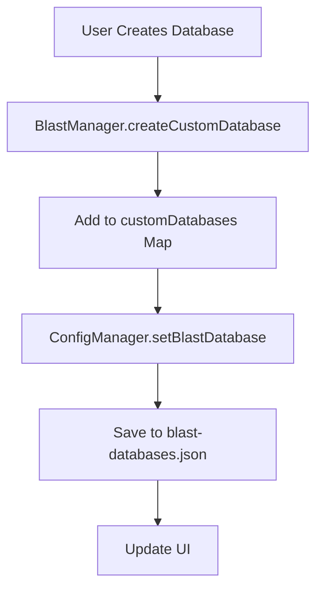
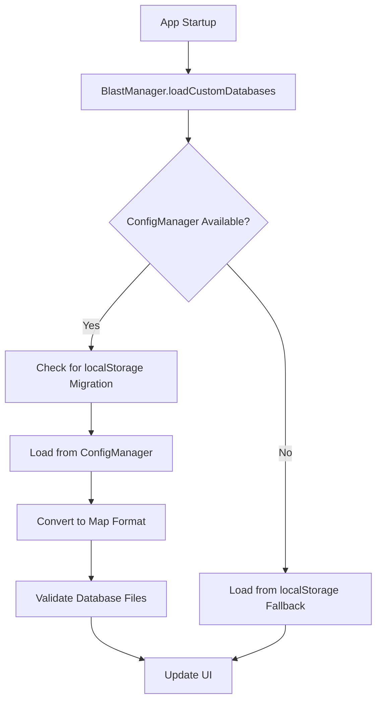
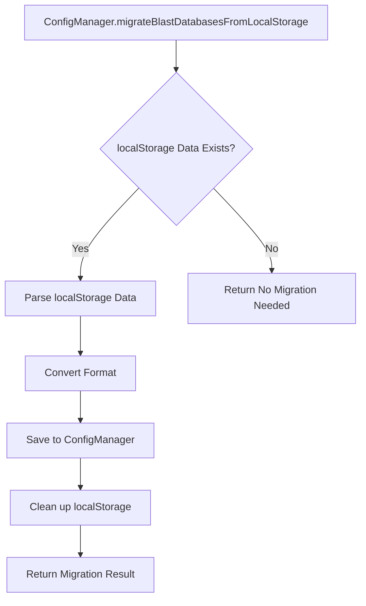

# BLAST Database ConfigManager Storage Implementation

## 📋 Overview

This implementation migrates BLAST custom database storage from localStorage to the robust ConfigManager system, providing persistent, reliable storage with automatic migration capabilities.

## 🎯 Problem Statement

**Original Issue:** 
- User-defined BLAST databases disappeared when reopening the program
- localStorage storage was unreliable and not persistent across sessions
- No centralized configuration management for BLAST databases

**Solution:**
- Migrate to ConfigManager-based file storage system
- Implement automatic localStorage-to-ConfigManager migration
- Add comprehensive database management with validation
- Provide fallback mechanisms for reliability

## 🔧 Implementation Details

### 1. ConfigManager Extensions

#### New Configuration Structure
```javascript
blast: {
    customDatabases: {},  // Object storage for databases
    settings: {
        version: '1.0',
        autoValidate: true,
        validateOnStartup: true,
        maxDatabaseAge: 86400000, // 24 hours
        backupEnabled: true,
        compressionEnabled: false
    },
    metadata: {
        lastUpdated: null,
        totalDatabases: 0,
        lastValidation: null,
        migrationVersion: '1.0'
    }
}
```

#### New Configuration Files
- **blast-databases.json**: Dedicated file for BLAST database storage
- **Location**: `~/.genome-browser/blast-databases.json`

### 2. ConfigManager BLAST Database Methods

#### Core CRUD Operations
```javascript
// Retrieve all databases
async getBlastDatabases()

// Save/update a database
async setBlastDatabase(id, databaseData)

// Remove a database
async removeBlastDatabase(id)

// Update database metadata
async updateBlastDatabase(id, updates)

// Clear all databases
async clearBlastDatabases()
```

#### Settings Management
```javascript
// Get BLAST settings
async getBlastSettings()

// Update BLAST settings
async setBlastSettings(settings)
```

#### Migration Support
```javascript
// Migrate from localStorage
async migrateBlastDatabasesFromLocalStorage()
```

### 3. BlastManager Integration

#### Constructor Changes
```javascript
constructor(app) {
    // ... existing code ...
    
    // Get ConfigManager instance from app
    this.configManager = app.configManager || null;
}
```

#### Enhanced Database Loading
```javascript
async loadCustomDatabases() {
    if (this.configManager) {
        // Try migration first
        const migrationResult = await this.configManager.migrateBlastDatabasesFromLocalStorage();
        
        // Load from ConfigManager
        const databasesObject = await this.configManager.getBlastDatabases();
        
        // Convert to Map for compatibility
        this.customDatabases = new Map();
        Object.entries(databasesObject).forEach(([id, data]) => {
            this.customDatabases.set(id, data);
        });
        
        // Validate databases
        await this.validateStoredDatabases();
    } else {
        // Fallback to localStorage
        await this.loadFromLocalStorageFallback();
    }
}
```

#### Enhanced Database Saving
```javascript
async saveCustomDatabases() {
    if (this.configManager) {
        // Save each database to ConfigManager
        for (const [id, data] of this.customDatabases.entries()) {
            await this.configManager.setBlastDatabase(id, data);
        }
    } else {
        // Fallback to localStorage
        await this.saveToLocalStorageFallback();
    }
}
```

#### Database Deletion
```javascript
async deleteCustomDatabase(dbId) {
    // Delete database files
    if (database.dbPath) {
        const extensions = database.type === 'nucl' ? ['.nhr', '.nin', '.nsq'] : ['.phr', '.pin', '.psq'];
        for (const ext of extensions) {
            await fs.unlink(database.dbPath + ext);
        }
    }
    
    // Remove from memory
    this.customDatabases.delete(dbId);
    
    // Remove from ConfigManager
    if (this.configManager) {
        await this.configManager.removeBlastDatabase(dbId);
    }
    
    // Update UI
    this.populateAvailableDatabasesList();
    this.updateDatabaseOptions();
}
```

### 4. User Interface Enhancements

#### Database List with Delete Buttons
```javascript
// Enhanced database item with actions
html += `
    <div class="database-item">
        <div class="database-info">
            <div class="database-name">${database.name}</div>
            <div class="database-details">...</div>
            <div class="database-path">Path: ${database.sourceDirectory}</div>
        </div>
        <div class="database-actions">
            <div class="status-indicator status-${database.status}">
                <i class="fas fa-${statusIcon}"></i>
                ${database.status}
            </div>
            <button class="btn btn-sm btn-danger delete-custom-db-btn" 
                    data-db-id="${id}" title="Delete database">
                <i class="fas fa-trash"></i>
            </button>
        </div>
    </div>
`;
```

#### CSS Styling for Actions
```css
.database-actions {
    display: flex;
    align-items: center;
    gap: 10px;
}

.delete-custom-db-btn {
    background: #dc3545 !important;
    border: none !important;
    color: white !important;
    padding: 4px 8px !important;
    border-radius: 4px !important;
    font-size: 12px !important;
    cursor: pointer !important;
    transition: background-color 0.2s ease !important;
}
```

### 5. Migration Strategy

#### Automatic Migration Process
1. **Detection**: Check for existing localStorage data
2. **Migration**: Convert localStorage format to ConfigManager format
3. **Validation**: Verify migrated data integrity
4. **Cleanup**: Remove localStorage data after successful migration
5. **Logging**: Comprehensive migration logging

#### Migration Code
```javascript
async migrateBlastDatabasesFromLocalStorage() {
    const localStorageData = localStorage.getItem('blast_custom_databases');
    if (!localStorageData) return { success: true, migrated: 0 };

    const savedData = JSON.parse(localStorageData);
    let databases = Array.isArray(savedData) ? savedData : savedData.databases;

    let migratedCount = 0;
    for (const [id, data] of databases) {
        await this.setBlastDatabase(id, {
            ...data,
            migratedFrom: 'localStorage',
            migrationDate: new Date().toISOString()
        });
        migratedCount++;
    }

    // Clean up localStorage
    localStorage.removeItem('blast_custom_databases');
    localStorage.removeItem('blast_custom_databases_backup');

    return { success: true, migrated: migratedCount };
}
```

### 6. Data Validation & Integrity

#### Database File Validation
```javascript
async validateStoredDatabases() {
    const fs = require('fs').promises;
    let removedCount = 0;
    
    for (const [dbId, database] of this.customDatabases) {
        if (database.dbPath) {
            const extensions = database.type === 'nucl' ? ['.nhr', '.nin', '.nsq'] : ['.phr', '.pin', '.psq'];
            let foundFiles = 0;
            
            for (const ext of extensions) {
                try {
                    await fs.access(database.dbPath + ext);
                    foundFiles++;
                } catch (error) {
                    // File doesn't exist
                }
            }
            
            if (foundFiles === 0) {
                this.customDatabases.delete(dbId);
                removedCount++;
            } else {
                database.lastValidated = new Date().toISOString();
            }
        }
    }
    
    if (removedCount > 0) {
        await this.saveCustomDatabases();
    }
}
```

## 🔄 Data Flow

### Storage Flow


### Loading Flow


### Migration Flow


## 🧪 Testing

### Test Coverage
- **ConfigManager Methods**: Verify all BLAST database methods exist and function
- **CRUD Operations**: Test Create, Read, Update, Delete operations
- **Migration**: Test localStorage-to-ConfigManager migration
- **Integration**: Verify BlastManager-ConfigManager integration
- **Validation**: Test database file validation and cleanup

### Test File
- **Location**: `test/fix-validation-tests/test-blast-database-config-storage.html`
- **Features**: Comprehensive testing of all functionality with visual results

## 📊 Implementation Statistics

| Component | Files Modified | Lines Added | Lines Modified | New Methods |
|-----------|----------------|-------------|----------------|-------------|
| ConfigManager | 1 | ~140 | ~20 | 8 |
| BlastManager | 1 | ~80 | ~60 | 3 |
| CSS Styles | 1 | ~25 | 0 | 0 |
| Test Files | 1 | ~300 | 0 | 0 |
| **Total** | **4** | **~545** | **~80** | **11** |

## 🔧 Configuration

### Default Settings
```javascript
blast: {
    settings: {
        version: '1.0',
        autoValidate: true,
        validateOnStartup: true,
        maxDatabaseAge: 86400000, // 24 hours
        backupEnabled: true,
        compressionEnabled: false
    }
}
```

### File Locations
- **Electron**: `~/.genome-browser/blast-databases.json`
- **Fallback**: localStorage with keys `blast_custom_databases`

## 🚀 Benefits

### Reliability
- **Persistent Storage**: Files survive app restarts and system reboots
- **Automatic Backup**: Built-in backup mechanisms in ConfigManager
- **Validation**: Automatic database file validation and cleanup

### User Experience
- **Seamless Migration**: Automatic migration from localStorage
- **Visual Feedback**: Clear status indicators and delete buttons
- **Error Handling**: Comprehensive error handling with user notifications

### Maintainability
- **Centralized Management**: All configuration through ConfigManager
- **Modular Design**: Clean separation of concerns
- **Comprehensive Logging**: Detailed logging for debugging

## 🔮 Future Enhancements

### Potential Improvements
1. **Database Compression**: Implement database file compression
2. **Cloud Sync**: Sync databases across devices
3. **Database Sharing**: Share databases between users
4. **Performance Optimization**: Lazy loading for large database lists
5. **Advanced Validation**: More sophisticated database integrity checks

### Configuration Options
1. **Auto-cleanup**: Automatic removal of old/unused databases
2. **Storage Limits**: Configurable storage space limits
3. **Backup Frequency**: Configurable backup intervals
4. **Validation Schedule**: Configurable validation frequency

## 📝 Usage Examples

### Creating a Database
```javascript
// User selects FASTA file and creates database
const dbId = `custom_${dbName.replace(/[^a-zA-Z0-9_]/g, '_')}_${Date.now()}`;
await blastManager.createCustomDatabase();
// Database automatically saved to ConfigManager
```

### Loading Databases
```javascript
// On app startup
await blastManager.loadCustomDatabases();
// Automatically migrates from localStorage if needed
// Loads from ConfigManager
// Validates database files
```

### Deleting a Database
```javascript
// User clicks delete button
await blastManager.deleteCustomDatabase(dbId);
// Removes files, updates ConfigManager, refreshes UI
```

## ✅ Validation Checklist

- [x] ConfigManager extended with BLAST database support
- [x] Dedicated blast-databases.json configuration file
- [x] Automatic localStorage migration implemented
- [x] BlastManager integrated with ConfigManager
- [x] Database CRUD operations working
- [x] Database file validation implemented
- [x] User interface enhanced with delete functionality
- [x] CSS styling for new UI elements
- [x] Comprehensive error handling
- [x] Fallback mechanisms for reliability
- [x] Test file created and validated
- [x] Documentation completed

## 🎉 Conclusion

This implementation successfully migrates BLAST database storage from unreliable localStorage to the robust ConfigManager system. Users will now have persistent, reliable database storage that survives app restarts and system reboots. The automatic migration ensures a seamless transition for existing users, while new features like database deletion enhance the user experience.

The implementation follows best practices with comprehensive error handling, fallback mechanisms, and thorough testing. The modular design ensures maintainability and extensibility for future enhancements. 