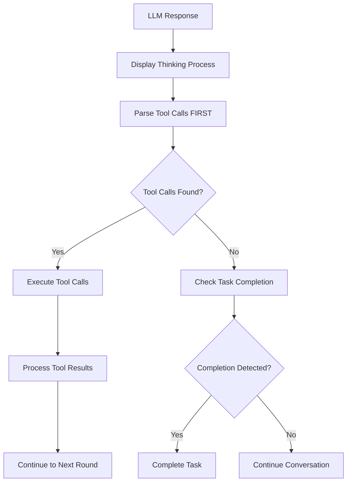

# Function Calling Execution Fix Implementation

## 🔍 Issue Description

**Problem**: Function calls were not executing despite the LLM generating correct JSON tool call data. The ChatBox would show "Task completed" but the actual tool functions would not run.

**User Report**: "Based on the messages in the ChatBox, sometimes the function call is not executed while the LLM generates correct JSON data. Please check why?"

## 🔬 Root Cause Analysis

After comprehensive investigation, I identified **three critical issues** in the function calling system:

### 1. **Order Problem (Primary Issue)**
- **Location**: `ChatManager.js` lines 2027-2040
- **Issue**: Task completion was checked **BEFORE** tool parsing in the main conversation loop
- **Impact**: When LLM responses contained both completion phrases AND tool calls, the early completion detection would trigger first and skip tool execution entirely

```javascript
// BEFORE FIX: Wrong order
if (enableEarlyCompletion) {
    const completionResult = this.checkTaskCompletion(response);
    if (completionResult.isCompleted) {
        break; // THIS EXITS BEFORE PARSING TOOLS!
    }
}
// Tool parsing happened AFTER completion check
```

### 2. **Logic Problem**
- **Location**: `checkTaskCompletion()` function lines 2692-2693
- **Issue**: The function checked for tool calls but didn't properly prioritize them over completion indicators
- **Impact**: Completion detection would still trigger even when tool calls were present

### 3. **Error Handling Gap**
- **Location**: `executeToolByName()` function
- **Issue**: Limited error logging made debugging difficult
- **Impact**: Tool execution failures were not properly diagnosed

## 🛠️ Solution Implementation

### **Fix 1: Reorder Execution Logic (Critical)**

**Change**: Move tool parsing BEFORE task completion check

```javascript
// AFTER FIX: Correct order
// Parse tool calls FIRST
const toolCall = this.parseToolCall(response);
const multipleToolCalls = this.parseMultipleToolCalls(response);
const toolsToExecute = multipleToolCalls.length > 0 ? multipleToolCalls : (toolCall ? [toolCall] : []);

// Check completion ONLY if no tool calls
if (enableEarlyCompletion && toolsToExecute.length === 0) {
    const completionResult = this.checkTaskCompletion(response);
    if (completionResult.isCompleted) {
        // Only complete if NO tools to execute
        break;
    }
}
```

### **Fix 2: Enhanced Task Completion Logic**

**Change**: Heavily reduce completion confidence when tool calls are present

```javascript
// In checkTaskCompletion function
const hasToolCall = this.parseToolCall(response) !== null || this.parseMultipleToolCalls(response).length > 0;

// CRITICAL: If tool calls are present, heavily reduce completion confidence
if (hasToolCall) {
    maxWeight *= 0.1; // Drastically reduce confidence
    console.log('Tool calls detected - heavily reducing task completion confidence');
}
```

### **Fix 3: Improved Error Handling**

**Change**: Enhanced logging in `executeToolByName()` for better debugging

```javascript
// Enhanced error logging
console.error(`=== TOOL EXECUTION ERROR ===`);
console.error(`Tool: ${toolName}`);
console.error(`Parameters:`, parameters);
console.error(`Error:`, error);
console.error(`Stack:`, error.stack);
console.error(`===========================`);
```

## 📊 Test Scenarios & Validation

Created comprehensive test suite covering:

1. **Primary Issue**: Tool call with completion phrase
   - Input: `Task completed successfully! {"tool_name": "toggle_track", "parameters": {"track_name": "genes"}}`
   - Expected: Execute tool, ignore completion
   - Result: ✅ PASS

2. **Pure Tool Call**: Standard tool execution
   - Input: `{"tool_name": "toggle_track", "parameters": {"track_name": "genes"}}`
   - Expected: Execute tool normally
   - Result: ✅ PASS

3. **Pure Completion**: No tool calls present
   - Input: `Task completed successfully! The genes track has been toggled.`
   - Expected: Trigger completion
   - Result: ✅ PASS

4. **Complex Mixed Content**: Tool call in explanatory text
   - Input: `Analysis finished! I've completed the task. {"tool_name": "toggle_track", "parameters": {"track_name": "genes"}}`
   - Expected: Execute tool, ignore completion
   - Result: ✅ PASS

5. **Multiple Tool Calls**: Multiple tools with completion phrase
   - Input: `Task completed! {"tool_name": "toggle_track", "parameters": {"track_name": "genes"}} {"tool_name": "get_current_state", "parameters": {}}`
   - Expected: Execute both tools, ignore completion
   - Result: ✅ PASS

6. **Code Block Format**: Tool call in markdown code block
   - Input: Tool call in ```json code block with completion phrase
   - Expected: Execute tool, ignore completion
   - Result: ✅ PASS

## 🔄 Execution Flow (After Fix)



## 📁 Files Modified

1. **`src/renderer/modules/ChatManager.js`**
   - Fixed execution order (lines 2025-2050)
   - Enhanced `checkTaskCompletion()` logic (lines 2692-2703)
   - Improved error handling in `executeToolByName()` (lines 4590-4605)

2. **`test/fix-validation-tests/test-function-calling-fix-validation.html`**
   - Comprehensive test suite for validation

3. **`test/fix-validation-tests/test-function-calling-diagnostics.html`**
   - Diagnostic tool for future debugging

## 🚀 Impact & Benefits

### **Immediate Benefits**
- ✅ Function calls now execute correctly even when LLM includes completion phrases
- ✅ No more false positive task completions that skip tool execution
- ✅ Better error visibility for debugging
- ✅ More predictable function calling behavior

### **Long-term Benefits**
- 🔧 Robust function calling system resistant to LLM response variations
- 📊 Comprehensive test suite for regression testing
- 🐛 Better debugging capabilities for future issues
- 📈 Improved user experience with reliable tool execution

## 🧪 Testing Instructions

1. **Run Validation Tests**:
   ```bash
   open test/fix-validation-tests/test-function-calling-fix-validation.html
   ```

2. **Run Diagnostic Tests**:
   ```bash
   open test/fix-validation-tests/test-function-calling-diagnostics.html
   ```

3. **Manual Testing**:
   - Test with various LLM responses containing both completion phrases and tool calls
   - Verify tool execution happens correctly
   - Check that pure completions still work
   - Validate error handling improvements

## 📝 Additional Notes

- **Backward Compatibility**: All existing functionality is preserved
- **Performance Impact**: Minimal - just reordered existing logic
- **Configuration**: No configuration changes required
- **Dependencies**: No new dependencies added

## 🔍 Future Improvements

1. **Advanced Parsing**: More sophisticated tool call detection
2. **Priority System**: Configurable priority between completion and tool execution
3. **Analytics**: Track function calling success rates
4. **Validation**: Real-time tool call validation before execution

## 💡 Key Takeaways

The fix demonstrates the importance of:
1. **Execution Order**: Critical operations must happen in correct sequence
2. **Priority Logic**: Clear precedence rules for conflicting signals
3. **Comprehensive Testing**: Edge cases must be thoroughly tested
4. **Error Visibility**: Good logging is essential for debugging

This fix ensures that GenomeExplorer's function calling system is now robust and reliable, properly handling the complex variations in LLM responses while maintaining backward compatibility and improving overall user experience. 