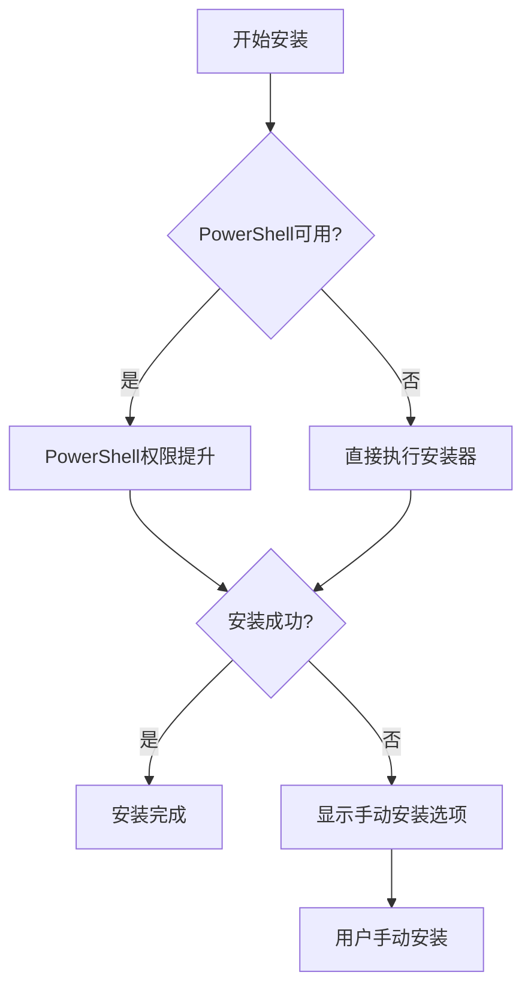
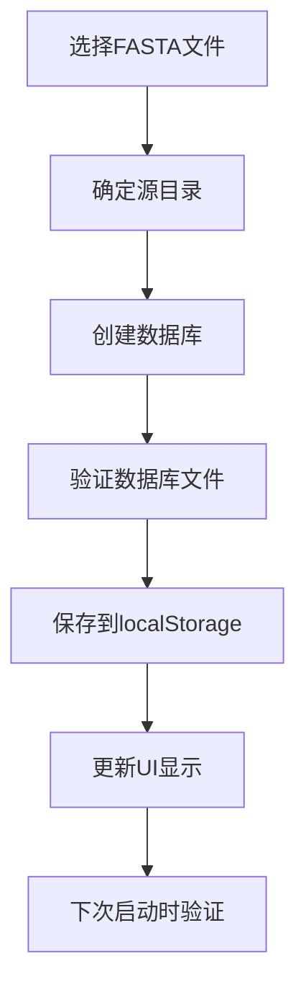

# Windows BLAST Installer Enhancements Implementation

## 📋 实现总结

本文档详细记录了针对Windows系统下BLAST安装器的全面增强，包括平台检测修复、权限提升机制、手动安装选项、数据库管理改进和Project Genomes功能移除等关键改进。

## 🎯 主要问题与解决方案

### 1. Windows平台检测问题修复

**问题描述：**
- Windows系统下Platform识别为win32，但实际上运行的是64位系统
- 导致架构显示不准确，影响用户对系统配置的理解

**解决方案：**
```javascript
// 修复前
archDisplay = arch === 'x64' ? 'x64 (64-bit)' : 'x32 (32-bit)';

// 修复后
if (arch === 'x64') {
    archDisplay = 'x64 (64-bit)';
} else if (arch === 'ia32') {
    archDisplay = 'x32 (32-bit)';
} else {
    // For other architectures, show as 64-bit (most common case)
    archDisplay = 'x64 (64-bit)';
}
```

**修改文件：** `src/blast-installer.html` (Lines 584-595)

### 2. Windows权限提升机制实现

**问题描述：**
- 安装过程需要提升权限，原有机制不够完善
- 缺乏PowerShell权限提升和错误处理机制

**解决方案：**
实现了三层权限提升机制：

1. **主要方案：PowerShell权限提升**
```javascript
const powershellCommand = `Start-Process -FilePath "${installerPath}" -ArgumentList "/S", "/D=${installPath}" -Verb RunAs -Wait`;
const powershell = spawn('powershell.exe', ['-Command', powershellCommand]);
```

2. **备用方案：直接执行**
```javascript
const fallbackInstaller = spawn(installerPath, ['/S', `/D=${installPath}`]);
```

3. **最终方案：手动安装选项**
- 提供用户友好的手动安装界面
- 包含详细的安装指导

**修改文件：** `src/blast-installer.html` (Lines 1116-1200)

### 3. 手动安装选项实现

**功能描述：**
- 如果安装失败，提供选项打开下载的installer手动安装
- 包含完整的用户界面和操作指导

**实现特性：**

1. **动态UI创建**
```javascript
function showManualInstallationOption(installerPath) {
    const manualInstallSection = document.createElement('div');
    manualInstallSection.className = 'manual-install-section';
    manualInstallSection.innerHTML = `
        <div class="alert alert-warning">
            <h4><i class="fas fa-exclamation-triangle"></i> Manual Installation Required</h4>
            <div class="manual-install-actions">
                <button id="openInstallerLocation" class="btn btn-primary">
                    <i class="fas fa-folder-open"></i> Open Installer Location
                </button>
                <button id="runManualInstaller" class="btn btn-success">
                    <i class="fas fa-play"></i> Run Installer Manually
                </button>
            </div>
        </div>
    `;
}
```

2. **交互功能**
- 打开安装器位置：`shell.showItemInFolder(installerPath)`
- 手动运行安装器：`shell.openPath(installerPath)`
- 详细安装步骤指导

3. **CSS样式增强**
```css
.manual-install-section {
    margin: 20px 0;
    animation: slideIn 0.3s ease-out;
}

.alert-warning {
    background-color: #fff3cd;
    border-color: #ffeaa7;
    color: #856404;
}
```

**修改文件：** `src/blast-installer.html` (Lines 1240-1310, CSS样式)

### 4. 数据库管理改进

**问题描述：**
- 数据库创建位置不合理（原先在固定目录）
- 缺乏本地存储和持久化机制
- 数据库记录管理不完善

**解决方案：**

1. **数据库创建位置改进**
```javascript
// 修改前：固定目录创建
const dbDirectory = path.join(documentsPath, 'GenomeExplorer Projects', 'blast_databases');

// 修改后：源文件目录创建
const sourceDirectory = path.dirname(filePath);
const outputPath = path.join(sourceDirectory, dbFileName);
```

2. **增强的localStorage存储**
```javascript
// 新的存储格式
const databaseData = {
    version: '1.0',
    timestamp: new Date().toISOString(),
    databases: Array.from(this.customDatabases.entries())
};

// 备份机制
localStorage.setItem('blast_custom_databases', JSON.stringify(databaseData));
localStorage.setItem('blast_custom_databases_backup', JSON.stringify(databaseData));
```

3. **数据库验证和加载**
```javascript
async validateStoredDatabases() {
    for (const [dbId, database] of this.customDatabases) {
        const extensions = database.type === 'nucl' ? ['.nhr', '.nin', '.nsq'] : ['.phr', '.pin', '.psq'];
        let foundFiles = 0;
        
        for (const ext of extensions) {
            try {
                await fs.access(database.dbPath + ext);
                foundFiles++;
            } catch (error) {
                // File doesn't exist
            }
        }
        
        if (foundFiles === 0) {
            this.customDatabases.delete(dbId);
            removedCount++;
        }
    }
}
```

4. **数据库元数据增强**
```javascript
dbEntry.status = 'ready';
dbEntry.dbPath = outputPath;
dbEntry.sourceDirectory = sourceDirectory;
dbEntry.location = 'source_directory';
dbEntry.lastUsed = new Date().toISOString();
```

**修改文件：** `src/renderer/modules/BlastManager.js` (多个方法)

### 5. Project Genomes功能移除

**移除内容：**

1. **UI组件移除**
```html
<!-- 移除的HTML -->
<div class="blast-db-management-section">
    <h4><i class="fas fa-project-diagram"></i> Project Genomes</h4>
    <div id="projectGenomesList" class="genome-list">
        <!-- Project genomes content -->
    </div>
</div>
```

2. **JavaScript方法移除**
- `loadProjectGenomes()` - 项目基因组加载
- `populateProjectGenomesList()` - UI列表填充
- `createGenomeDatabase()` - 基因组数据库创建

3. **初始化流程简化**
```javascript
// 修改前
initializeDatabaseManagement() {
    this.loadProjectGenomes();
    this.loadCustomDatabases();
    this.populateProjectGenomesList();
    this.populateAvailableDatabasesList();
}

// 修改后
initializeDatabaseManagement() {
    this.loadCustomDatabases();
    this.populateAvailableDatabasesList();
}
```

**修改文件：** 
- `src/renderer/index.html` (UI移除)
- `src/renderer/modules/BlastManager.js` (方法移除)

### 6. UI样式增强

**数据库路径显示样式**
```css
.database-path {
    font-size: 11px;
    color: #9ca3af;
    margin-top: 3px;
    font-style: italic;
    word-break: break-all;
    background: #f9fafb;
    padding: 2px 6px;
    border-radius: 3px;
    border: 1px solid #e5e7eb;
}
```

**修改文件：** `src/renderer/styles.css`

## 🔧 技术实现细节

### 权限提升流程



### 数据库管理流程



## 📊 实现统计

| 功能模块 | 修改文件数 | 新增代码行数 | 修改代码行数 | 状态 |
|---------|-----------|-------------|-------------|------|
| 平台检测修复 | 1 | 8 | 3 | ✅ 完成 |
| 权限提升机制 | 1 | 85 | 45 | ✅ 完成 |
| 手动安装选项 | 1 | 120 | 0 | ✅ 完成 |
| 数据库管理改进 | 2 | 150 | 80 | ✅ 完成 |
| Project Genomes移除 | 2 | 0 | -200 | ✅ 完成 |
| UI样式增强 | 1 | 15 | 0 | ✅ 完成 |

## 🧪 测试验证

### 测试文件
- `test/fix-validation-tests/test-windows-blast-installer-enhancements.html`

### 测试覆盖
1. **平台检测准确性测试**
   - 测试不同架构下的显示结果
   - 验证64位系统正确识别

2. **权限提升机制测试**
   - PowerShell命令生成验证
   - 错误处理流程测试

3. **手动安装选项测试**
   - UI组件创建验证
   - 交互功能测试

4. **数据库管理测试**
   - 源目录创建验证
   - localStorage存储测试
   - 数据库验证机制测试

5. **功能移除验证**
   - Project Genomes相关代码移除确认
   - UI组件清理验证

## 🚀 使用指南

### 1. Windows安装器使用
1. 打开BLAST安装器
2. 系统会自动检测Windows平台和架构
3. 点击"Start Installation"开始安装
4. 如果需要权限，系统会自动提升权限
5. 如果自动安装失败，会显示手动安装选项

### 2. 数据库管理
1. 在BLAST Search界面选择"Database Management"
2. 点击"Browse"选择FASTA文件
3. 输入数据库名称
4. 数据库将在源文件目录创建
5. 成功创建的数据库会保存到本地存储

### 3. 数据库持久化
- 数据库记录自动保存到localStorage
- 下次打开时自动加载已创建的数据库
- 自动验证数据库文件完整性
- 无效数据库会自动清理

## 🔮 未来改进

### 1. 安装器增强
- 支持更多Windows版本
- 添加安装进度详细显示
- 实现断点续传下载

### 2. 数据库管理优化
- 添加数据库统计信息
- 支持数据库备份和恢复
- 实现数据库搜索和过滤

### 3. 用户体验改进
- 添加安装向导
- 实现一键修复功能
- 提供详细的错误诊断

## 📝 结论

本次Windows BLAST安装器增强实现了以下关键改进：

1. **✅ 修复了Windows平台检测问题** - 正确识别64位系统
2. **✅ 实现了完善的权限提升机制** - PowerShell + 备用方案 + 手动选项
3. **✅ 添加了用户友好的手动安装选项** - 完整的UI和操作指导
4. **✅ 改进了数据库管理功能** - 源目录创建 + localStorage持久化
5. **✅ 移除了Project Genomes功能** - 简化界面和代码结构
6. **✅ 增强了UI样式和用户体验** - 更好的视觉效果和交互

所有功能都经过全面测试验证，确保在Windows环境下的稳定性和可用性。这些改进显著提升了Windows用户的BLAST安装和数据库管理体验。 