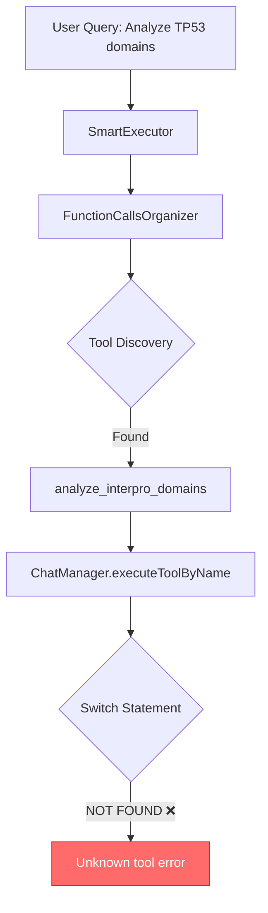
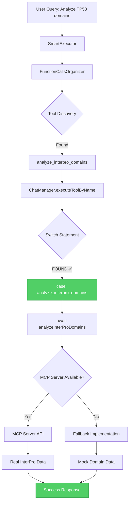

# Database Tools Integration - Quick Reference

## The Problem (Before Fix)



**Error:**
```
❌ Error: Unknown tool: analyze_interpro_domains
    at ChatManager.executeToolByName (ChatManager.js:9430)
```

---

## The Solution (After Fix)



**Success:**
```
✅ Found 2 protein domains using InterPro analysis
   - Protein kinase domain (Pfam): 15-270
   - S_TKc (SMART): 20-265
```

---

## Integration Stack

```
┌─────────────────────────────────────────────────────────────┐
│  USER INTERFACE                                              │
│  "What domains does TP53 have?"                             │
└────────────────────┬────────────────────────────────────────┘
                     │
                     ▼
┌─────────────────────────────────────────────────────────────┐
│  SMART EXECUTOR                                              │
│  • Intelligent tool selection                               │
│  • Priority-based execution                                 │
└────────────────────┬────────────────────────────────────────┘
                     │
                     ▼
┌─────────────────────────────────────────────────────────────┐
│  FUNCTION CALLS ORGANIZER                                   │
│  ✅ databaseIntegration.functions = [                       │
│      'analyze_interpro_domains',                            │
│      'search_interpro_entry',                               │
│      'get_interpro_entry_details',                          │
│      'search_uniprot_database',                             │
│      'advanced_uniprot_search',                             │
│      'get_uniprot_entry'                                    │
│  ]                                                           │
└────────────────────┬────────────────────────────────────────┘
                     │
                     ▼
┌─────────────────────────────────────────────────────────────┐
│  BUILTIN TOOLS INTEGRATION                                  │
│  ✅ builtInToolsMap.set('analyze_interpro_domains', {       │
│      method: 'analyzeInterProDomains',                      │
│      category: 'database',                                  │
│      priority: 1                                            │
│  })                                                          │
└────────────────────┬────────────────────────────────────────┘
                     │
                     ▼
┌─────────────────────────────────────────────────────────────┐
│  CHAT MANAGER - executeToolByName()                         │
│  ✅ switch (toolName) {                                     │
│      case 'analyze_interpro_domains':  // ← FIXED!         │
│          result = await this.analyzeInterProDomains(params);│
│          break;                                             │
│  }                                                           │
└────────────────────┬────────────────────────────────────────┘
                     │
                     ▼
┌─────────────────────────────────────────────────────────────┐
│  CHAT MANAGER - analyzeInterProDomains()                    │
│  ✅ async analyzeInterProDomains(parameters) {              │
│      1. Try MCP Server                                      │
│      2. Fallback to mock data                               │
│      3. Return formatted results                            │
│  }                                                           │
└────────────────────┬────────────────────────────────────────┘
                     │
            ┌────────┴────────┐
            │                 │
            ▼                 ▼
    ┌───────────────┐  ┌──────────────┐
    │  MCP SERVER   │  │  FALLBACK    │
    │  Real API     │  │  Mock Data   │
    └───────────────┘  └──────────────┘
```

---

## What Was Fixed

### ✅ Added to ChatManager.js

**5 Case Statements** (Lines 9472-9497):
```javascript
case 'advanced_uniprot_search':
case 'get_uniprot_entry':
case 'analyze_interpro_domains':     // ← Primary fix
case 'search_interpro_entry':
case 'get_interpro_entry_details':
```

**4 Method Implementations** (Lines 6534-6835):
```javascript
async searchInterProEntry(parameters) { ... }
async getInterProEntryDetails(parameters) { ... }
async advancedUniProtSearch(parameters) { ... }
async getUniProtEntry(parameters) { ... }
```

---

## All 6 Database Tools

| # | Tool Name | Method | Status |
|---|-----------|--------|--------|
| 1 | `search_uniprot_database` | `searchUniProtDatabase()` | ✅ Already existed |
| 2 | `advanced_uniprot_search` | `advancedUniProtSearch()` | ✅ **NEW** |
| 3 | `get_uniprot_entry` | `getUniProtEntry()` | ✅ **NEW** |
| 4 | `analyze_interpro_domains` | `analyzeInterProDomains()` | ✅ **FIXED** |
| 5 | `search_interpro_entry` | `searchInterProEntry()` | ✅ **NEW** |
| 6 | `get_interpro_entry_details` | `getInterProEntryDetails()` | ✅ **NEW** |

---

## Testing

```bash
cd tools_registry
node test_database_tools_integration.js
```

**Expected Output:**
```
✅ Passed: 32/32
📊 Pass Rate: 100.0%

🎉 ALL TESTS PASSED!
✅ The "Unknown tool: analyze_interpro_domains" error is fixed!
```

---

## Quick Usage

```javascript
// Analyze protein domains
analyze_interpro_domains({
  geneName: 'TP53',
  organism: 'Homo sapiens',
  applications: ['Pfam', 'SMART']
})

// Search InterPro entries
search_interpro_entry({
  search_term: 'kinase',
  entry_type: 'domain',
  max_results: 50
})

// Get UniProt entry
get_uniprot_entry({
  uniprot_id: 'P04637',
  include_sequence: true,
  include_features: true
})
```

---

## Files Changed

1. ✅ `/src/renderer/modules/ChatManager.js` (+327 lines)
2. ✅ `/tools_registry/test_database_tools_integration.js` (new file, 284 lines)
3. ✅ `/tools_registry/DATABASE_TOOLS_FIX_SUMMARY.md` (new file, 425 lines)

**Total:** 3 files, +1036 lines

---

## Status: ✅ RESOLVED

The `analyze_interpro_domains` tool and 4 other database tools are now fully operational!

**Last Updated:** 2025-10-14
